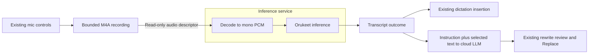

# Delivery plan: Optional Orukeet offline dictation

## What Changed After Probe

The user authorized full implementation after reviewing the emulator results. The spec and plan are active for implementation with the conventional inference service. Physical-device findings remain release gates and the required probe stays pending; this explicit user instruction supersedes the earlier task-activation hold. Execute the mapped tasks, retain measured evidence, and do not treat a successful emulator run as release approval.

The review prompted separate activation/steady-state memory gates, per-file model delivery, a larger probe, an isolated-process comparison, explicit audio-file ownership, and reproducible typing measurements. Source checks also corrected three claims: sherpa has a filename loader, the pinned Hugging Face revision has no individual payload URLs, and upstream publishes Dutch FLEURS results. See [review findings](research/review-revisions/findings.md).

## Runtime packaging revision during implementation

The upstream 1.13.4 AAR includes unused GPL eSpeak/TTS code, despite sherpa-onnx itself being Apache-2.0. The application now uses an ASR-only build of the same pinned source (`142807252687d81b40d6315f23470a1512a00de3`), original Kotlin bindings and ONNX Runtime 1.27.0. TTS, diarization, C API, binaries, websocket and portaudio are disabled; Eigen uses MPL2-only code. The build-time AAR is 19,696,942 bytes, SHA-256 `db5e489fb948e98a3c5cba14b1a5fe4e32aff68e238e971c4f27cb2db968677e`. It contains arm64-v8a and x86_64 JNI/ORT libraries only. 32-bit keyboard/cloud APKs remain supported without local native libraries. See `tools/orukeet-runtime/` for reproduction, pins and notices. Earlier stock-AAR memory/size figures are historical; model files/hashes are unchanged. Final native and package checks pass against this build; see [implementation evidence](research/implementation-verification.md).

## Technical Context

Inspected baseline: `12fa074c`. Ownkey uses Kotlin/Compose, AGP 9.0.0, min SDK 26, target/compile SDK 36, and NDK 29. Current source supplements the older shared context.

| Existing component | Planned work |
| --- | --- |
| `ime/text/dictation/TranscriptionClient.kt` | Add `OrukeetTranscriptionClient`; adapt the recording payload while preserving transcript-returning behavior. |
| `ime/text/dictation/TranscriptionOperations.kt` | Preserve transcription/insertion separation; introduce specific model/resource/runtime failures. |
| `ime/text/dictation/VoxtralDictationManager.kt` | Explicit backend resolver, readiness, and per-session configuration snapshot. |
| `ime/text/dictation/AudioRecorder.kt` | Preserve M4A controls; add a file-backed payload and cleanup ownership, local decode, and duration bound. |
| `ime/text/dictation/AudioSessionCoordinator.kt` | Add `LOCAL` mode; preserve microphone leases and generation-based invalidation. |
| `ime/text/rewrite/CloudAiAvailabilityPolicy.kt` and callers | Generalize editor/secure/incognito policy to `AiAvailabilityPolicy`; keep backend readiness separate. |
| `ime/text/rewrite/VoiceRewriteWiring.kt`, `VoiceRewriteSessionManager.kt` | Local readiness, backend snapshot, and local-audio/cloud-text disclosure. |
| `app/settings/voxtral/VoxtralScreen.kt`, `app/AppPrefs.kt`, string resources | Model lifecycle card, backend selection, migration, and retained cloud settings. |
| `FlorisApplication.kt`, manifest, build files | Minimal inference-process startup and lazy native runtime packaging. |
| `app/settings/advanced/BackupScreen.kt`, backup XML | Exclusions and reconciliation of restored settings with missing models. |

Paths above are relative to `app/src/main/kotlin/dev/patrickgold/florisboard/`. [Research findings](research/android-integration/findings.md) link the inspected sources.

The baseline `benchmark/` module had app-startup and keyboard-idle-power checks. Implementation adds a real-touch typing and repeated warm keyboard-open harness; Stage E runs the physical comparison. APK splits and CI collection now preserve all four existing ABIs.

## Architecture Decisions

### 1. Optional model download with a packaged runtime

Use ONNX INT8 through sherpa-onnx. Bundle a pinned native runtime with matching Kotlin/JNI bindings in the app, loaded only on explicit local use. Download model data, tokens, and notices separately. This supports Play and standalone APKs with one model manager. Play restricts external downloads of executable `.so`, DEX, and JAR code. [Play policy](https://support.google.com/googleplay/android-developer/answer/16559646?hl=en).

Historical probe candidate: the standard `sherpa-onnx-1.13.4.aar`. The application now pins the ASR-only artifact described above. Release metadata reports 48,847,529 bytes (48.8 MB) and SHA-256 `03f9c4df965f21c71269365a7951a7f23b5696fddd093fa318c80d65550ab780`. This is the compressed dependency across upstream ABI builds, not the per-device install increase. The initial probe verified the stock digest and four ABIs. Final packaging uses the ASR-only two-ABI runtime; measure compressed APK/AAB download and installed native size per delivered ABI. [Release metadata](https://api.github.com/repos/k2-fsa/sherpa-onnx/releases/tags/v1.13.4).

Use Play AAB ABI delivery and per-ABI standalone GitHub APKs, with an explicitly labeled arm64 build for local ASR. Configure release APK splits with no universal APK, and update artifact collection, filenames, checksums, and install/upgrade checks for every existing supported ABI. Keep ordinary keyboard installation available on other ABIs; local ASR is arm64-gated. AAB delivery selects the device ABI, not always arm64. Gradle now produces four standalone ABI APKs with no universal APK. Build the AAB separately with `-Pownkey.apkSplits=false` because AGP resource shrinking rejects simultaneous multi-APK/AAB packaging. Reconsider runtime delivery if measured phone install overhead is unacceptable. Model weights remain absent from every APK/AAB. [Android split guidance](https://developer.android.com/build/configure-apk-splits).

Initial candidate, pinned by the [upstream downloader](https://github.com/Oruk-AI/orukeet/blob/main/examples/download_onnx.py):

| Field | Value |
| --- | --- |
| Model repository/revision | `oruk/orukeet` at `55a984d46f68323301837194ce647c702f55facc` |
| Android delivery | Seven individual files, byte-identical to the pinned manifest |
| Download / installed payload bytes | 671,619,800 / 671,619,800, approximately 672 MB each |
| Manifest SHA-256 | `7e80f93f0e9b923c392424b0f85d28a717feee0a4d2a6aa9bfa723693868e727` |
| Source archive for mirror preparation only | `sherpa-onnx-orukeet-v0.1.0-int8.tar.bz2`, 486,807,585 bytes |
| Source archive SHA-256 | `f9191f30178cc9122ce2f023bf9fefafc822028307b0efa4caff645ba3fe8d0a` |

Sizes/hashes come from the [pinned manifest](https://huggingface.co/oruk/orukeet/resolve/55a984d46f68323301837194ce647c702f55facc/onnx/manifest.json). Its hash was independently checked during planning and review; subsequent emulator and integration work downloaded and verified all seven payloads. The files are `encoder.int8.onnx`, `decoder.int8.onnx`, `joiner.int8.onnx`, `tokens.txt`, `bpe.vocab`, `LICENSE-WEIGHTS`, and `NOTICE.md`. New exports require a new candidate ID, hashes, and benchmarks.

sherpa-onnx 1.13.4 was published on 2026-07-07. Its Android arm64 build defaults to ONNX Runtime 1.27.0, matching Orukeet's export environment. This reduces version uncertainty; Android graph loading and operator availability still require evidence. Use CPU, offline transducer, `model_type=nemo_transducer`, 16,000 Hz input, and feature dimension 128. Load encoder, decoder, joiner, and tokens from the same verified release. Preserve model metadata and required runtime operators, including `DynamicQuantizeLSTM`. [Android build](https://github.com/k2-fsa/sherpa-onnx/blob/v1.13.4/build-android-arm64-v8a.sh), [export requirements](https://github.com/Oruk-AI/orukeet/blob/main/export/onnx/requirements.txt), [ONNX instructions](https://github.com/Oruk-AI/orukeet/blob/main/export/onnx/README.md).

Use `OfflineRecognizer(assetManager = null, config = ...)` with downloaded file paths. In this version, the filename constructor passes paths directly to ORT; the AssetManager constructor reads each graph into a buffer first. Do not add a Java/native whole-model byte-array copy. ORT's embedded-weight parsing and runtime allocations can still overlap. The review's 2-3x encoder-size estimate is a stress scenario, not a proven minimum: for the 653,182,378-byte encoder it is about 1.22-1.83 GiB before other allocations. Measure activation independently from idle and transcription. [Kotlin selection](https://github.com/k2-fsa/sherpa-onnx/blob/v1.13.4/sherpa-onnx/kotlin-api/OfflineRecognizer.kt), [native loader](https://github.com/k2-fsa/sherpa-onnx/blob/v1.13.4/sherpa-onnx/csrc/offline-transducer-model.cc), [ORT parsing](https://github.com/microsoft/onnxruntime/blob/v1.27.0/onnxruntime/core/graph/model.cc).

### 2. Separate downloaded, selected, and running states

Add typed `TranscriptionBackend` configuration. Keep installation metadata in `ModelStore`, selected/previous backend in preferences, and loading/busy/failure state in the runtime connection. File presence alone never enables local dictation.

| Model state | UI/action | Current provider |
| --- | --- | --- |
| Not downloaded | Download; sizes, compatibility, attribution | Unchanged |
| Waiting for Wi-Fi / downloading | Progress, cancel, explicit mobile-data option | Unchanged |
| Verifying / installing | Progress, safe cancel | Unchanged |
| Downloaded, inactive | Activate; Delete model | Unchanged |
| Activating | Compatibility/load check; cancel | Previous selection until success |
| Active | On device badge; Deactivate; Delete model | Orukeet |
| Missing/damaged/incompatible | Specific error, retry/redownload, provider settings | Local selection fails closed |
| Update available | Download update | Existing verified version |

Activation performs a local load smoke test and saves selection only on success. It does not open the microphone. Use the existing permission flow when microphone access is needed.

Deactivation keeps files and explicitly restores the previous route; show that destination, including external voice input when applicable. Deleting an active model confirms deactivation, cancels work, releases native resources, then removes files. Preserve cloud keys/settings.

Migration keeps the current behavior when the new preference is unset: configured ASR with a key, otherwise the existing release external-IME path. Debug mocks remain test behavior. Local readiness requires a verified compatible model, never a cloud key. Snapshot backend, model version, format, and capabilities once per session. Hold a model-version lease until completion so a settings/update change cannot reroute recorded audio or remove files in use.

Stage D adds `AudioSessionMode.LOCAL` and generalizes `CloudAiAvailabilityPolicy`, its state/reason types, factory, UI wording, and callers to backend-neutral AI editor availability. The existing policy checks active editor, secure field, and incognito state; preserve those checks. Model readiness, microphone permission, cloud ASR credentials, and cloud rewrite credentials remain distinct capability checks. Local failures must not say cloud AI is unavailable.

### 3. Resumable download and verified installation

Ship a catalog entry with model ID, revision, trusted manifest hash, sizes/per-file hashes, ABI/runtime constraints, and notices. Use HTTPS. The expected manifest hash must be trusted through the app release, rather than accepting an arbitrary remote checksum beside a file.

Choose a model-specific GitHub Release in the Ownkey repository as the public download origin. The pinned Hugging Face revision exposes only its archive, manifest, and README under `onnx/`; it cannot currently serve the seven files individually. During Stage B release preparation, verify the source archive and safely extract it off-device, verify all seven payload hashes, and publish those exact files alongside the manifest, license, notices, and provenance. Pin a versioned tag and explicit asset URLs in the catalog; never resolve `latest`. The [model-data mirror](https://github.com/MajesteitBart/ownkey-keyboard/releases/tag/orukeet-v0.1.0-int8) is published. All seven payload hashes and the ten uploaded asset digests were verified; anonymous encoder/notice range requests returned the expected bytes. Availability checks remain part of release verification. [Pinned tree](https://huggingface.co/api/models/oruk/orukeet/tree/55a984d46f68323301837194ce647c702f55facc/onnx?recursive=true&limit=100), [GitHub assets](https://docs.github.com/en/repositories/releasing-projects-on-github/about-releases).

The probe can prepare the same verified files locally from the archive without publishing. Android downloads never extract an archive. Per-file delivery costs about 185 MB more transfer and saves about 487 MB of phone staging plus decompression work. Anonymous hosting is not an unlimited-service guarantee: test redirected asset URLs, range responses, expiry, 429/5xx backoff, and cancellation. Hugging Face also limits anonymous resolver requests; do not embed an access token in the app. A future alternate mirror must serve identical hashes through a catalog revision. [Hub limits](https://huggingface.co/docs/hub/en/rate-limits).

Use user-initiated transfer jobs on Android 14+ and a compatible foreground download worker on earlier supported releases. Persist one transfer record and interruption-safe partial files; show progress/cancel and bounded retries. Start with Wi-Fi or Ethernet, offering explicit mobile-data use. Metered Wi-Fi remains Wi-Fi: do not add an unmetered-only constraint that the user did not select. Allow VPN networks and declare the resumable transfer chunk to Android. Resume ranges only when revision, size, and response validators agree; otherwise restart. Pin dependencies and implement API-level behavior against the [Android transfer guidance](https://developer.android.com/develop/background-work/background-tasks/data-transfer-options).

Store staging and models under `noBackupFilesDir/ai-models/`, outside startup-cleared cache and existing `ime/` backup/extension paths. The current extension manager handles keyboard/theme/language-pack ZIPs; use a dedicated model lifecycle.

Check free space for remaining candidate bytes plus a proposed 256 MiB reserve. A first installation needs 940,055,256 bytes, about 940 MB / 897 MiB, before small filesystem/catalog overhead. A same-sized update needs that much additional free space while retaining the existing model, about 1.612 GB total model-plus-reserve occupancy. Reuse valid staged bytes when resuming; recheck space during transfer and hashing. Atomic same-filesystem promotion must not make a second candidate copy.

Download and stream-hash one file at a time, with bounded I/O priority so cloud dictation and typing remain responsive. Use a fixed catalog filename allowlist, per-file expected byte limits, `.part` state, and full-file verification after resume. Reject malformed manifests, unknown names, changed content, truncation, and oversize responses. Test valid 206 ranges, ignored Range returning 200, invalid Content-Range, and 416 without concatenating incompatible data. Remove Android bzip2 dependencies, extraction, and tar-specific tests from scope. Atomically promote the verified directory/pointer on the same filesystem; partial files never become installed/selectable.

Updates require a user action. Verify the candidate, wait for session leases to end, and unload the resident recognizer before load-testing its replacement. Never keep two large recognizers resident for an update. Retain one previous known-good on-disk copy until the replacement succeeds. Clean up old versions afterward. Reboot or restore never starts a new download. A restored local selection without files shows Download required and neither downloads nor silently falls back.

### 4. Dedicated inference process

Use a narrow Android library boundary, `lib/offline-asr`, for the pinned adapter. Bind an unexported service only during activation or explicit local voice use. The first bounded comparison of `android:isolatedProcess="true"` with a conventional process is complete on the x86_64 16 KB emulator. Stock sherpa model reopening and Android M4A decoding failed inside isolation; continue Stage A with the conventional `:offline_asr` process. Isolation remains a separate contingency requiring a descriptor-native loader and a working audio path. An isolated process has a separate UID and no app permissions, including INTERNET. The main app still has network access for downloads/cloud features. [Android service isolation](https://developer.android.com/guide/topics/manifest/service-element).

The isolated experiment passed model descriptors read-only. Direct descriptor reads succeeded; reopening `/proc/self/fd` returned permission denied and ORT aborted. M4A decoding separately raised `IOException` before loading. [Runtime evidence](research/emulator-runtime.md) records both findings. Do not widen file permissions or use shared model storage to bypass them. A future isolated design must consume descriptors directly, verify tokens/seek/metadata/external-data handling, establish a working audio path, and remeasure any buffering cost. Hold descriptors for the lifetime required by the loader/recognizer, then close them. For now, use the conventional unexported process with no cloud/network clients in the adapter and test absence of egress. A same-UID process contains crashes but provides no permission-level network sandbox. Do not expose a network-capable Binder operation to inference.

Before `FlorisApplication` initializes cache cleanup, dictionaries, clipboard, extensions, or preferences, branch into minimal startup for this process. Existing startup clears cache and initializes keyboard services; running it twice risks temporary-file deletion and duplicate datastore access. Keep preferences owned by the main process and pass immutable session configuration to the service.

Use one inference worker with no stale-utterance queue. Begin testing at two CPU threads, compare 1/2/4, and select the measured profile. Load only on activation or explicit use, never keyboard-open. Compare immediate unload, two-minute retention, and five-minute retention after last use, including time hidden. Hide still invalidates/cancels the utterance and deletes audio immediately; an idle recognizer may retain only model state. Release utterance streams/tensors before retention. Select a device-tier retention policy from reopen latency, resident PSS, host-process survival, battery/thermal results, and app-switch tests.

Unload on deadline, applicable `onTrimMemory`/`onLowMemory` signals, deactivation, deletion, or teardown. A hide/UI-hidden signal starts the chosen grace policy rather than necessarily unloading. Trim delivery varies by OS, so use an explicit deadline and handle process death without relying on callbacks. Do not run background inference, reload automatically after death, hold a wake lock, or add a keepalive foreground service for retention.

Stage C introduces a file-backed recording payload for local sessions. `stopAndRead()` currently reads bytes and deletes the recorder's cache file, so it cannot supply the proposed descriptor unchanged. Make the destination/payload strategy explicit: local capture writes to private `noBackupFilesDir/ai-audio/`, finalizes M4A, and transfers an owned read-only descriptor; cloud/mock clients keep their existing byte payload through an adapter. The main session owns deletion and closes its handle on completion, cancel, timeout, or service death; the service closes its duplicate and decoded buffers. Reconcile orphaned session files after main-process death. Exclude this directory from manual backup as well as platform backup, and never place it in startup-cleared cache.

Do not write a byte array back to disk just to cross Binder. Change the recorder/payload interfaces and both voice consumers together, while retaining transcript-returning behavior. Close streams/recognizers deterministically. Cancellation invalidates results immediately and must stop native work through a verified path. If decoding cannot be interrupted, terminate/recreate only the inference process. An isolated service must terminate itself through a bounded shutdown/watchdog path; do not assume the parent UID can signal it. Never release a recognizer concurrently with decoding or assume coroutine cancellation freed native resources. Include service death, OOM, and timeout in the first probe.

### 5. Bounded phrase dictation first

Reuse the `MediaRecorderAudioRecorder` capture behavior with the new local file-backed payload to preserve pause/resume and amplitude behavior. Decode AAC inside the inference service using Android media APIs, inspect actual channel/rate output, downmix/resample if needed, and normalize samples for sherpa. M4A bytes cannot be treated as PCM. Add format fixtures. Switch to direct `AudioRecord` PCM capture only if measured benefits justify recording-flow changes.

Propose a 30-second active-recording cap for local dictation, excluding pauses; voice rewrite uses the lower of its current cap and this limit. Display the limit and warn near it. At the cap, stop once and process the whole bounded recording. Use a tested speech-presence check for empty/silent audio without introducing another downloadable VAD model in v1.

Return a completed phrase after stop. Orukeet is full-context ASR, so streaming partials and chunk reconciliation remain later work. Lower and disclose the cap before release if memory/latency gates require it. [Upstream model constraints](https://github.com/Oruk-AI/orukeet/blob/main/export/onnx/README.md).

### 6. Clear provider and privacy boundaries

Settings path: **AI -> Dictation -> Orukeet (on device)**. Show download/installed sizes, version, status, supported-device guidance, notices, and separate Activate/Deactivate/Delete actions. Use Ownkey tokens, localized strings, accessible 48 dp controls, progress announcements, and adaptive cards. Show On device in the keyboard and distinct Preparing model/Transcribing states with cancel.

Retain cloud language hints but hide/disable them for Orukeet with an automatic multilingual-recognition explanation. Test Dutch, English, and mixed phrases; do not promise forced-language support or equal quality across upstream languages. Do not sync local model files or phone backend selection to Wear OS.

Local ordinary dictation has no network stage. Voice rewrite can still send recognized instruction text and selected text to the configured LLM. Update provider capability metadata and disclosure version/copy for local audio plus cloud text, and for switching back to cloud ASR. Preserve preview/Replace, target validation, secure fields, and current incognito restrictions. Local incognito support is separate future policy work.

Local failure never uploads audio or launches a fallback voice IME. Users can explicitly change provider and record again. Delete temporary audio on every terminal path and process recovery; retain no audio/transcript history or content-bearing logs. Benchmark evidence contains only consent-safe aggregate metrics.

Keep model `LICENSE-WEIGHTS`, `NOTICE.md`, NVIDIA/Oruk attribution, and runtime dependency notices in an offline-accessible licenses view. The weights are CC BY-SA 4.0; code/dependencies have separate terms. Review later modified-weight distribution separately. [Upstream attribution](https://github.com/Oruk-AI/orukeet/blob/main/NOTICE.md).

## Policy and Contract Checks

- [x] Local contracts remain the delivery source of truth.
- [x] Probe required and pending; measurements are not claimed.
- [x] Acceptance and evidence gates are defined.
- [x] Planning includes no external sync or publishing.

## Generated Artifact Map

- `spec.md`: proposed product behavior and acceptance scenarios.
- `plan.md`: architecture, staged work, gates, rollout, and rollback.
- `research/android-integration/`: inspected evidence and research closeout.
- `research/review-revisions/`: review triage, primary-source corrections, and revision evidence.
- `decisions.md`, `updates/`: recommendations, planning outcome, validation.
- `workstreams/`, `tasks/`: active implementation contracts under the user-authorized probe exception; physical qualification remains a release gate.

## Complexity Exceptions

The inference process adds IPC/lifecycle work. The Ownkey team should retain it unless the probe demonstrates an equally safe simpler approach; large native allocations and failures must not break everyday typing.

## Probe-Driven Architecture Changes

Initial emulator findings are recorded in the [runtime probe](research/emulator-runtime.md): graph loading/transcription, activation and inference peaks, failed stock isolation, conventional cancellation/death/retry, verified inputs and 16 KB packaging. Physical findings remain pending. Record phone/OS/ABI, artifact/runtime hashes, actual loader, process decision, thread count, activation peak, resident/inference memory, retention policy, load/cancel behavior, cap, quality subsets, and release overhead. Fold physical results into the spec and record release go/no-go. Implementation is already authorized under the exception at the top of this plan.

## Workstream Design

The table defines bounded work packages and ownership boundaries. Estimates are engineering effort for one Android engineer with test-device access, subject to the probe.

| Stage | Scope and owner boundary | Dependency | Completion evidence | Effort |
| --- | --- | --- | --- | --- |
| A. Device feasibility | ASR engineer: standalone harness, typing baseline, exact runtime/M4A input, isolation comparison, native lifecycle and profiling | Draft spec/probe brief | Reproducible phone results, go/no-go, approved spec and revised plan before B | 3-5 days, including up to half a day for isolation |
| B. Model lifecycle | Storage/download owner: prepare mirror, catalog, per-file transfer, integrity, install/remove/update/restore | A passes and spec approved | Verified assets; interrupted/corrupt/low-space cases; cloud dictation during transfer | 4-5 days |
| C. Inference service | Runtime owner: process startup, file-backed audio, decode, model leases, retention, cancellation and cleanup | A passes and spec approved | Native smoke/cancel/death/memory/lifecycle results | 4-6 days |
| D. Routing and AI UI | Voice-flow owner: local session mode, general editor policy, migration, readiness, snapshots, disclosure, voice rewrite | B/C interfaces stable | Cloud/local routes and complete user journey pass | 4-6 days |
| E. Release verification | QA/release owner: benchmark migration, device matrix, typing/privacy checks, notices/copy, ABI splits and builds | B-D complete | Evidence-backed supported tier, signed artifacts and optional rollout | 5-8 days |

Planning envelope: 20-30 engineering days for one Android engineer with test-device access, including the 3-5 day probe. This includes harness construction, scoring, two-device profiling, soak/kill checks, and release packaging. It assumes the initial runtime/artifact path passes. External-data re-export, a new TDT adapter, device procurement, or repeated failed probes require a new estimate; they are not hidden inside this envelope.

## Milestone Strategy

### A0. Emulator setup and functional experiments

Prepare API 36 x86_64 emulators with ordinary and 16 KB pages and verify boot, ADB control, and actual guest page size. Setup results are recorded in [emulator evidence](research/emulator-setup.md). The user subsequently authorized integrated implementation while retaining the physical release gates.

Use these emulators for the standalone harness's graph/operator loading, M4A/descriptor handling, service isolation, cancel/death handling, per-file transfer/integrity, and UI/state-machine experiments. The standalone harness now exists and completed graph/WAV/M4A checks and conventional cancel/death/retry on the 16 KB guest. Stock isolation failed model reopening and M4A decode. The real Wi-Fi transfer job, integrated settings, standard 4 KB lifecycle, and 16 KB WAV/M4A lifecycle checks now pass; see implementation verification for the final runtime pin and reruns. The native module includes arm64 and x86_64 for internal app verification; public local-ASR support remains arm64-gated and disabled until phone qualification. An x86_64 16 KB guest can expose packaging/loader problems, but passing it does not prove arm64 binaries load on an arm64 16 KB device.

Keep emulator memory/timing measurements labeled as emulator results. Configuring 6 GB of guest RAM does not reproduce a 6 GB phone's CPU, memory pressure, battery, or thermal behavior. Physical-device measurements remain required for the supported tier and performance go/no-go. A0 is part of the existing Stage A budget, not an additional estimate or a blanket reason to defer all probe work.

### A. Physical-device go/no-go

Test a recent arm64 phone with at least 8 GB RAM and a mid-range arm64 phone with roughly 6 GB. These are probe candidates, not advertised minimum requirements. Add a 4 GB/low-memory device to explore the support boundary. Check API 26 compatibility and API 35/36 integration; use a 16 KB-page emulator for packaging, not speed claims.

Build a standalone sample at `tools/orukeet-probe/` with its own Gradle settings, host editor, service variants, capture path, instrumentation driver, and aggregate result exporter. It is excluded from the product's module graph and release artifacts. The original app-change hold was superseded by explicit implementation authorization. Preserve the standalone harness for comparison, and use the integrated tests for final runtime evidence. Run the installed baseline Ownkey IME against the probe's editor while the probe process loads/transcribes/downloads/hashes. Simulate lease/generation/death handling in the harness; full Ownkey insertion, routing, and editor guarantees are retested in B-E after integration. Reusable typing/open checks now live in `benchmark/` and the runtime adapter in `lib/offline-asr`. Store aggregate results, fixture provenance, tool versions, and hashes under this project's research evidence, never weights or private recordings.

1. Prepare verified per-file payloads off-device from the source archive and reproduce a known public sample with the exact INT8 export. Load every graph through the Android filename path. Record the actual AAR/ORT binary versions and ABI inventory.
2. Use at least 50 Dutch and 50 English consented/public phrases: short/long input, names, numbers, punctuation, accents, quiet/noisy conditions, silence, and some mixed-language speech. Apply documented text normalization. Keep private recordings and raw transcripts out of repository artifacts.
3. Measure service bind, model loading, audio decode, inference, and stop-to-insert separately. Run at least 10 cold loads and 30 warm operations per latency bucket. Record median/p95 and real-time factor (processing time divided by recording duration).
4. Profile activation from service start through all graph initialization, first inference, idle residency, transcription, and unload as separate phases. Capture frequent RSS/high-water/allocator or Perfetto data to detect short activation spikes, with timestamped PSS samples for attribution; occasional `dumpsys meminfo` alone is insufficient. Record sampling limits. Include service, IME, and host Java/native memory, system available memory, and process deaths. Java heap alone misses model allocations.
5. Run 15 minutes of repeated dictation on both primary phones. Compare first/last-window timings, battery/thermal status, and CPU use after cancellation/unload. Measure typing/open during load, inference, per-file transfer, and hashing. Compare hide/reopen at 30 seconds, two minutes, and five minutes under immediate/2-minute/5-minute retention, with trim/low-memory pressure and another foreground app active.
6. Kill the service during load/decode, inject allocation failure and observe constrained-device OOM behavior, cancel while native code runs, change fields, hide the keyboard, and remove/reload the model. Record simulated versus OS-triggered failure evidence separately. Verify no automatic network retry, stale harness callback, or IME loss. Time-box the isolated-service descriptor, no-network-permission, and bounded termination experiment to half a day.

Proposed targets to confirm or explicitly revise after measurement:

| Gate | Initial target |
| --- | --- |
| Quality | Clean in-domain WER <=10% for Dutch and English separately. Inspect names/numbers and noisy subsets separately; compare with the same ONNX artifact on a reference machine. |
| Warm latency | Stop-to-insert p95 <=3 s for 5 s audio; <=5 s for 10 s audio; <=15 s for 30 s audio. |
| Cold preparation | Model-ready p95 <=10 s; responsive progress/cancel throughout. |
| Activation memory | Report peak RSS/high-water and sampled PSS separately, including first-inference lazy allocations. Provisional ceiling: service peak RSS <=1.5 GiB, not merely post-load PSS. No OOM, ANR, or host/IME loss; record system memory headroom on each supported tier. |
| Resident/inference memory | Report idle PSS/RSS and warm-inference peaks separately; provisional service ceiling <=1.5 GiB. Do not average these with activation to obtain a pass. Derive a lower resident budget and supported-device policy from the probe. |
| Repeated use | Retained memory growth <=10% after warmup across 30 phrases; unload returns near pre-load memory. |
| Cancellation | UI acknowledgement <=250 ms; native work releases resources or its process terminates within 2 s. |
| Typing and keyboard-open | Each metric's same-device p95 regression <=5% with model absent, installed inactive, loading, transcribing, downloading, hashing, and hidden resident state; use the protocol below. |
| Sustained use | No severe/critical thermal state; final-window latency <=1.5x first-window; no inference CPU after unload. Record battery drain without inventing a universal percentage threshold. |

Upstream reports Dutch FLEURS WER of 5.60% across 364 read-speech recordings. That does not establish pinned INT8 phone quality. Keep the <=10% clean in-domain Dutch/English gate, report WER/CER and sample counts for names, numbers, noise, and mixed-language subsets separately, and inspect exact names/numeric-value errors so normalization cannot hide them. Treat small subsets as exploratory and expand them when needed for a support claim. Do not infer subset failure or success from the pooled FLEURS result. [Upstream per-language evidence](https://github.com/Oruk-AI/orukeet/blob/main/docs/current-checkpoint-benchmarks.md).

If the 6 GB device fails activation, first confirm the filename loader and eliminate avoidable copies. Record the failed tier; do not silently raise the ceiling. Compare these contingencies before accepting a narrower supported tier or enabling public availability:

- Re-export the INT8 model using ONNX external tensor data and a path-based loader, to test whether mapped weights reduce activation pressure. This is a new artifact with new files, hashes, catalog entry, distribution notices/provenance, quality parity, and memory/latency tests. Mapping depends on the runtime/platform and is not guaranteed; revisit isolated-process FD access for external tensors. [ORT external-data loading](https://github.com/microsoft/onnxruntime/blob/v1.27.0/onnxruntime/core/framework/tensorprotoutils.cc).
- Build on the ONNX Runtime Android package directly with a Kotlin TDT decoder. Estimate feature extraction, per-feature normalization, recurrent state, token/duration decoding, output parity, and cancellation work; this is more than swapping a dependency. Direct ORT can give control over allocations, but loading the same self-contained graph does not itself solve embedded-weight memory overhead.

If the recent phone fails materially, keep public availability disabled. An inconclusive 3-5 day probe is not a pass. Record failed gates, a bounded next experiment and revised estimate, or a no-go. The spec remains active for authorized implementation; release requires the missing evidence.

### Typing and keyboard-open measurement protocol

Use the added benchmark; app-startup time is not keyboard-open time. Use a synthetic host editor and fixed EN/NL input with suggestions/autocorrect enabled, recording timings and synthetic event IDs only. Inject real key taps through device instrumentation so Ownkey handles input; programmatic host `setText` or whole-string injection bypasses the typing path.

- Typing latency: input-event monotonic timestamp at key-down to the first host pre-draw after the corresponding editor change. Correlate the injected event with the fixture's `TextWatcher` callback using the same device clock. Keep tap dwell/cadence fixed and report absolute milliseconds alongside the ratio. Measure autocorrection commits separately; also inspect frame/suggestion trace delays so the metric does not hide visible stalls.
- Keyboard-open latency: focused editor's `showSoftInput` request to IME-visible window insets and the next completed host draw. Record cold IME start and warm reopen separately, with a first successful key as an interactivity check. Keep animation settings fixed.
- Compare the same baseline commit and candidate on each phone with identical build/profile compilation, layout, dictionary/settings, refresh rate, OS, and power/thermal conditions. Alternate baseline and load conditions. Stage A adds external probe load to the untouched IME; Stage E repeats against the real integration, including candidate-with-model-absent versus baseline.
- After warmup, collect at least 20 paired rounds per condition, each with 100 measured taps and 10 measured warm keyboard opens. The harness discards ten warm-up taps and one warm-up opening per round. Report pooled typing p50/p95 and keyboard-open p95, sample counts, and `100 * (candidate / baseline - 1)`. Bootstrap paired whole rounds for a 95% interval; upper bound ≤5% passes, lower bound >5% fails, overlap is inconclusive. Keep cold IME starts as a separately traced phone gate; repeated warm openings do not measure cold startup. Record device timings, not ADB command round-trip latency.
- Exercise absent, installed-inactive, activation, warm inference, transfer, verification hashing, and retained-while-hidden states. Add explicit cloud dictation during download in the integrated checks. Archive metric definitions and script versions with aggregate evidence so later releases reproduce the comparison.

### B. Usable internal build

Download -> verify -> Activate -> airplane-mode dictate -> Deactivate -> Delete works end-to-end. Include local voice-instruction transcription and its cloud-text disclosure before public availability because both voice flows share routing.

### C. Optional release

Acceptance scenarios, supported-device matrix, performance evidence, notices, and release builds pass. Existing installs keep their route. Offer download on validated configurations and always keep activation explicit. Gate the add-on by ABI/capability without restricting ordinary keyboard installation on other devices.

Stage E updates `.project/context/play-store-usps.md` and release-facing metadata/privacy copy to distinguish verified on-device dictation, cloud dictation, and local instruction transcription followed by cloud rewrite. The current caveat that cloud AI must not be called local remains valid; revise broad wording that would describe every dictation route as cloud. Claims and screenshots follow the shipped behavior and supported tier. Follow the existing copy review before publishing; this planning revision changes no live store copy.

## Rollout Strategy

Start with internal builds and consenting testers on measured devices, then opt-in beta and normal release. Keep one pinned model in the initial catalog. Do not poll model/update endpoints from the keyboard or auto-download on upgrade. Use local release/catalog compatibility rules to prevent activation of known-bad combinations without creating an online dependency for offline dictation. Product availability follows measured hardware and runtime support, not an assumed RAM threshold.

## Test Strategy

| Area | Required checks |
| --- | --- |
| Lifecycle | No auto-download/activation; restart/reboot; network changes; denied notification permission; per-file resume/cancel/retry and 200/206/416/429; full storage; malformed catalog/unknown names; bad hashes/oversize files; atomic install; update rollback with model lease; removal during inference; cloud dictation during transfer/hash. |
| Audio/native | Real AAC file-backed fixtures; descriptor ownership and orphan cleanup; actual sample-format conversion; silence/very short audio; cap/pause/resume; operators; activation versus steady-state memory; native exception/death/OOM; timeout, cancellation, retention and trim. |
| Routing/editor | Upgrade with/without keys; release external-IME behavior; debug mocks; no-key local use; backend changes mid-session; mic contention; editor switch/hide; secure/incognito; late results; insertion spacing. |
| Voice rewrite | Local instruction is not inserted as dictation; LLM key and disclosure remain required; retries remain session-safe; preview/Replace and target validation pass. |
| Privacy/storage | Network-blocked cold/warm operation plus attempted-egress capture with networking enabled; isolated UID/permission/FD checks if selected; no upload on local errors; no audio/history in idle recognizer, logs or backups; restore neither auto-downloads nor falls back. |
| UI | Every state/error; local badge; active deletion confirmation; EN/NL copy; TalkBack; 48 dp targets; large font; portrait/landscape/tablet. |
| Distribution | Verified per-file mirror and notices; no weights in APK/AAB; measured dependency and per-device installed overhead; standalone ABI artifacts/install/upgrade; Play ABI delivery; arm64/unsupported ABI behavior; shrinking/JNI rules; dependency notices; 16 KB alignment of every prebuilt library and final package. |

During implementation extend existing transcription, audio-session, voice-rewrite, and cross-flow suites. Run relevant JVM/instrumentation checks plus `:app:compileDebugKotlin`, `:app:compileReleaseKotlin`, and `:app:assembleRelease`; include the AAB release build for Play. Follow then-current repository CI/release instructions. Run `git diff --check` and Delano validation for contracts. Check dependency binaries for 16 KB compatibility even with NDK 29. [Android page-size guidance](https://developer.android.com/guide/practices/page-sizes).

Implementation and emulator evidence is recorded in `research/implementation-verification.md`. JVM, package and integrated Android checks have run. Physical quality/performance gates remain pending.

## Rollback Strategy

Users can deactivate and retain/delete the model, explicitly restoring their previous route. Failed updates leave the old verified version usable. A corrective app release can disable a broken local combination and explain recovery, but must not silently route audio to cloud. Revert local adapter/service/UI work if necessary while preserving current cloud dictation/rewrite. Reconcile orphaned temporary model/audio data specifically, rather than deleting broad cache directories.

## Remaining Delivery Risks

- Emulator activation/inference high-water memory and a 15-minute repeated-transcription run are recorded. Phone peaks, app-switch pressure, mobile speed and heat remain unmeasured.
- Runtime/input hashes, all native ELF alignments, x86_64 graph execution and probe APK alignment are verified. Stock isolated model reopening and M4A decoding failed; use the conventional process for the next probe. Final per-ABI APK sizes and alignment are recorded. Physical arm64 execution and installed/delivered Play size remain pending.
- Inference startup now skips datastore/keyboard/cache initialization; continue checking this boundary during future application startup changes.
- The GitHub per-file mirror is published and its anonymous/range behavior is verified; the pinned upstream revision only publishes an archive. Changed external-data artifacts or a direct ORT decoder require a revised estimate and fresh evidence.
- Upstream multilingual results do not establish Ownkey phone accuracy. Language and device claims must follow the measured corpus and hardware matrix.
