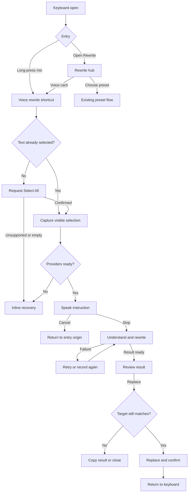

# Spec: Voice-Prompt Rewrite

## Executive Summary

Add a voice-instruction path to Ownkey Android's existing rewrite experience, led by a direct shortcut on the dictation key. A normal tap continues to start dictation; a platform-timed long-press produces haptic feedback, enters `Speak your instruction`, resolves the rewrite target, and starts recording a one-off instruction. If text is already selected, that selection is the target. If nothing is selected, Ownkey visibly invokes Select All and confirms the resulting whole-field selection before recording.

The feature adapts the strongest parts of Ownkey Windows: capture the selected text at the start, use a distinct voice-editing mode, show clear listening/rewriting states, and leave the source text unchanged whenever the flow fails or is cancelled. It deliberately keeps Android's safer preview-before-replace behavior instead of copying Windows' immediate replacement.

The existing Rewrite panel retains a visible `Tell Ownkey what to change` action as the discoverable and TalkBack-friendly route to the same flow. Preset rewrites remain available and unchanged. Long-press is an accelerator, not the only way to find or operate voice rewrite, and it never changes the meaning of a normal mic tap.

Ordinary dictation and voice rewrite share one recording-control language. While either mode records, the first action row carries a real microphone-level waveform in its center, followed by pause/resume and cancel controls; the existing mic position becomes an orange stop-recording button. The button retains its useful idle, triggered/recording, processing, success, and error treatments, but it no longer impersonates an audio meter. Error treatment is transient and returns to idle after approximately five seconds.

The network path is explicit and provider-controlled:

1. Recorded instruction audio is sent to the configured dictation/transcription endpoint.
2. The resulting instruction and captured selected text are sent to the configured rewrite endpoint.
3. Ownkey shows the rewrite for review and only modifies the editor after `Replace` is tapped.

Ownkey does not provide a hosted relay. Audio, instruction text, and selected text must not be retained as history, emitted to telemetry, or written to content-bearing logs.

Incognito mode disables every cloud AI action. While the active editor session is incognito, dictation, preset rewrite, and voice rewrite are unavailable, and their controls state that reason instead of failing silently.

## Problem and Users

### Problem

The current Android rewrite panel is optimized for reusable preset instructions such as improving writing, shortening text, changing tone, or translating. It cannot express a one-off intent such as:

- make this sound less defensive
- turn the dates into a checklist
- keep the first paragraph and summarize the rest
- answer in the same tone, but more directly

Users must either accept a coarse preset, leave the host app to use another AI interface, or create a permanent custom preset for a temporary need. That breaks the keyboard-native promise and makes free-form rewriting materially slower than the Windows experience.

### Primary Users

- People composing messages, documents, or posts who want a one-off transformation without leaving the current app.
- Mobile users for whom speaking an instruction is faster than creating or editing a preset.
- Multilingual users who may speak an instruction in a different language from the selected text.
- Privacy-conscious BYOK users who need to understand which configured providers receive audio and text.
- Tablet and split-keyboard users who need controls kept within a comfortable central reach area.

### Existing Baseline

- `RewriteOptionsPanel` replaces the keyboard body with a two-column preset grid.
- `LlmRewriteManager` captures selected text or falls back to the previous sentence, runs a preset, previews the result, and replaces the stored range only after `Insert`.
- `VoxtralDictationManager` owns microphone capture and transcription but currently commits its transcript directly to the editor.
- The visible `DictationMicPill` already communicates idle, listening, paused, processing, inferred success, and error, but its listening bars are driven by a looping sine animation rather than microphone input.
- `VoiceRecordingRow` and `VoiceRecordingRowModel` contain the shared timer, center waveform, pause/resume, cancel, and stop composition rendered from `Smartbar` for both voice modes.
- `AudioRecorder.currentAmplitude()` and `VoxtralDictationManager.audioLevelFlow` provide a live signal for a truthful shared recording surface; the presentation still needs device calibration, smoothing, history, lifecycle tests, and wiring.
- Incognito is currently a learning-suppression flag only. `EditorInstance` resolves it per session from the preference or the host app's `flagNoPersonalizedLearning`, and `NlpManager` uses it to skip personalized learning and mark provider calls as private sessions. Neither the dictation nor the rewrite package references it, and neither package gates on password/secure fields today, so both the incognito gate and the secure-field gate are new work rather than preserved behavior.
- The supplied Android screenshots establish compact portrait and expanded tablet/split-layout baselines.

## Outcome and Success Metrics

### Outcome

Users can issue an arbitrary spoken rewrite instruction against selected text—or a visibly selected whole field when no selection exists—review the result, and safely replace only that confirmed target without leaving the host application or creating a preset.

### Success Metrics

Metrics are gathered through internal tests and consented usability sessions. This project must not add production telemetry for typed, selected, spoken, transcribed, or rewritten content.

1. **Task success:** at least 9 of 10 first-time test participants complete long-press mic -> confirm selected/whole-field scope -> speak instruction -> review -> replace without coaching or leaving the host app.
2. **Interaction cost:** the accelerator path requires one long-press plus no more than two taps after target resolution: stop recording and replace. The visible Rewrite-panel path requires no more than four deliberate taps.
3. **Safety:** 100% of cancellation, provider failure, focus-change, stale-selection, and empty-result acceptance tests leave host text unchanged.
4. **Target integrity:** 100% of replacement tests modify only the originally captured selection, and replacement is blocked if the editor session or target content no longer matches.
5. **Configuration clarity:** at least 9 of 10 test participants can identify that audio and selected text may go to two separately configured providers before their first voice rewrite.
6. **Accessibility:** the full happy path and every recovery action are operable with TalkBack and touch targets of at least 48 dp.
7. **Responsiveness:** existing keyboard-open and ordinary key-input benchmark p95 values regress by no more than 5%; microphone and network work never run on a typing-critical thread.
8. **Adaptive layout:** compact phone, landscape phone, expanded tablet, and split-keyboard screenshot checks pass without clipped copy, off-screen primary actions, or controls stranded at the far screen edges.
9. **Recording feedback fidelity:** controlled silence, quiet speech, and normal speech produce visibly distinct center-waveform levels on the supported device matrix; no active waveform is generated from a fixed loop or random values.
10. **Transient terminal feedback:** a successful recording outcome returns the action button to idle after about 900 ms, and every terminal error presentation returns it to idle after 5 seconds within a 250 ms test tolerance unless the user starts a new action sooner.

## User Stories

- US-001: As a writer, I want to long-press the familiar dictation key and speak a one-off edit, so I do not need to leave the app or create a permanent preset.
- US-002: As a frequent preset user, I want my existing rewrite voices to remain available, so the new feature does not slow down familiar actions.
- US-003: As a cautious user, I want to review a generated rewrite before replacement, so a transcription or model mistake cannot silently overwrite my text.
- US-004: As a multilingual user, I want to speak the instruction in whichever language is natural to me and still get my text back in its own language, unless I explicitly ask for another one, so editing never silently translates my writing and translation stays available when I want it.
- US-005: As a BYOK user, I want to see which provider handles audio and which handles rewriting, so the data path is understandable before use.
- US-006: As a user with a failed network request, I want my selected text and recognized instruction preserved long enough to retry, so I do not need to start over unnecessarily.
- US-007: As a tablet user, I want recording and result controls near the center of the keyboard surface, so a wide layout remains comfortable.
- US-008: As a screen-reader user, I want state changes and actions announced in words, so waveform color and animation are never the only feedback.
- US-009: As a privacy-conscious user, I want cancellation or focus loss to stop work and discard temporary audio, so the keyboard does not continue processing in the wrong context.
- US-010: As a user editing sensitive input, I want cloud rewrite actions unavailable in password fields, so secure content is not accidentally sent to a provider.
- US-011: As a user who has not selected text, I want Ownkey to visibly select the whole field before recording, so I can see and understand the scope that will be sent and replaced.
- US-012: As a person speaking, I want the waveform to respond to my actual voice, so I can tell whether Ownkey is receiving useful audio.
- US-013: As a dictation user, I want the recording button to show a stop action instead of decorative audio bars, so its effect is obvious before I tap it.
- US-014: As a user who encounters a recording error, I want a noticeable but temporary error signal, so the mic does not appear permanently broken after the problem has passed.
- US-015: As a user in incognito mode, I want every cloud AI action switched off and clearly labelled as unavailable, so nothing I speak or select is sent to a provider while I am in a private session.

## Acceptance Scenarios

- AC-001: Given non-empty text of 12,000 characters or fewer is selected and both providers are ready, when the user long-presses the dictation key, then Ownkey consumes the gesture without starting normal dictation, produces haptic/state feedback, captures that selection, and enters voice-rewrite recording.
- AC-002: Given the user taps rather than long-presses the dictation key, when the gesture completes, then ordinary dictation starts exactly as it does today and voice rewrite does not activate.
- AC-003: Given no text is selected, when voice rewrite is invoked from either entry path, then Ownkey visibly requests Select All, waits for a confirmed non-empty selection update, shows `Whole field · <count> characters`, and only then starts recording.
- AC-004: Given Select All is unsupported, produces no selection, or the field is empty, when voice rewrite resolves its target, then Ownkey does not open the microphone or send a request and shows `Select text manually` or `Nothing to rewrite`.
- AC-005: Given selected text is valid, when the user opens Rewrite, then a pinned `Tell Ownkey what to change` action appears above the existing preset grid without removing or renaming saved presets.
- AC-006: Given TalkBack is active, when focus is on the dictation key, then an explicit `Voice rewrite` accessibility action is available without requiring the user to discover or perform a long-press.
- AC-007: Given a password or other secure editor field is active, when rewrite actions are evaluated, then voice and preset cloud rewrite actions are disabled and no selected content is read for AI use.
- AC-008: Given microphone permission is missing, when the user starts a voice instruction, then Ownkey shows an inline explanation and `Open AI settings`; no recording or network request starts.
- AC-009: Given the dictation/transcription provider is not configured, when the user starts a voice instruction, then Ownkey identifies the missing dictation configuration rather than reporting a generic rewrite failure.
- AC-010: Given the rewrite provider is not configured, when the user starts a voice instruction, then Ownkey identifies the missing rewrite configuration before recording begins.
- AC-011: Given both providers are configured but the first-use disclosure has not been acknowledged, when the user starts a voice instruction, then Ownkey names the audio and rewrite providers and requires an explicit `Continue` before recording.
- AC-012: Given recording is active, when the user taps pause and resume, then elapsed time excludes the paused interval and the state is announced as `Paused` or `Listening`.
- AC-013: Given recording is active, when the user taps cancel, closes Rewrite, changes fields, or hides the keyboard, then recording and downstream jobs stop, temporary audio is discarded, and source text is unchanged.
- AC-014: Given recording contains no usable speech, when transcription completes empty, then Ownkey shows `Didn't catch that` with `Record again`; no rewrite request is sent.
- AC-015: Given transcription succeeds, when rewrite processing starts, then the recognized instruction is shown in the processing/result UI and is not inserted into the host editor.
- AC-016: Given transcription fails, when the error is shown, then the selection remains unchanged and the user can record again or return to presets.
- AC-017: Given transcription succeeded but rewriting fails, when the error is shown, then the recognized instruction and captured target remain available for `Try again` while the same editor session remains valid.
- AC-018: Given a rewrite result is visible, when the user taps `Try again`, then Ownkey reuses the same captured text and recognized instruction without reopening the microphone.
- AC-019: Given a rewrite result is visible, when the user taps the instruction chip's mic action, then Ownkey discards the pending result and records a replacement instruction against the original captured text.
- AC-020: Given the host text, selection range, focused app, or editor session changes after capture, when the user taps `Replace`, then Ownkey blocks replacement, keeps the generated result visible, and offers `Copy result` or `Close` instead of writing into an uncertain target.
- AC-021: Given a selected or Select-All target exceeds 12,000 Unicode characters, when voice rewrite resolves the target, then Ownkey reports the limit before microphone or network use and leaves the visible selection unchanged.
- AC-022: Given normal dictation is recording or transcribing, when voice rewrite is requested, then Ownkey blocks the second audio flow with `Finish dictation first`; only one microphone session exists.
- AC-023: Given voice rewrite is recording or processing, when normal dictation is requested, then the dictation action is disabled until voice rewrite exits.
- AC-024: Given a compact-height or landscape layout, when the result is longer than the available panel body, then only the result body scrolls and the back, retry, and replace actions remain visible.
- AC-025: Given an expanded tablet or split-keyboard layout, when voice recording, processing, or result review is shown, then the content is centered within its maximum width and primary controls are not pinned to opposite screen edges.
- AC-026: Given TalkBack or reduced motion is enabled, when the flow changes state, then semantic status text is announced, decorative motion is removed, measured-level feedback follows its reduced-motion contract, and every icon-only control has a specific accessible label.
- AC-027: Given a non-incognito session and the user selects a preset instead of the voice action, when rewriting completes, then the existing preset behavior and saved prompt ordering remain functionally unchanged.
- AC-028: Given ordinary dictation or voice rewrite enters active recording, when the first action row renders, then it shows elapsed time, a centered live waveform, pause/resume and cancel controls immediately to the waveform's right, and an orange stop button in the normal dictation-key position.
- AC-029: Given the recorder reports silence, quiet speech, and normal speech, when audio samples update, then the waveform settles near its baseline for silence and visibly follows the recent measured amplitude for speech without using a looping, random, or prerecorded pattern.
- AC-030: Given recording is active, when the user pauses, then capture and elapsed time pause, the waveform settles to a dim low baseline, and the pause control becomes `Resume`; when the user cancels, captured audio is discarded; when the user taps the stop button, capture ends and processing starts exactly once.
- AC-031: Given recording has stopped and transcription is pending, when the action row changes state, then the waveform is replaced by a labelled processing status, the mic button shows its existing processing treatment rather than a stop action, and cancel remains available outside the button.
- AC-032: Given dictation completes successfully, when the explicit success outcome is emitted, then the mic button shows its green success treatment for approximately 900 ms before returning to idle.
- AC-033: Given recording, transcription, or insertion fails, when the explicit error outcome is emitted, then the mic button shows its red error treatment, announces the error once, remains available for immediate retry, and automatically returns to idle after approximately five seconds without requiring another tap.
- AC-034: Given reduced motion is enabled, when recording is active, then the center meter still communicates measured input at a reduced update rate without looping or traveling motion, while all decorative halo and interpolated transition motion is removed.
- AC-035: Given the active editor session is in incognito mode, when the user invokes the dictation key by tap or long-press, opens the Rewrite hub, or selects a preset, then no microphone session opens and no provider request is sent, and the affected controls appear visibly disabled with `AI is off in incognito mode` rather than a generic failure or an inert control.
- AC-036: Given incognito mode ends for the active editor session, when the user next invokes dictation or rewrite, then the actions are available again with no residual disabled state, and no request that was blocked while incognito was active is replayed.
- AC-037: Given source text in one language and a spoken instruction in another that requests no language change, when the rewrite returns, then the result is in the source text's language and the instruction's own language does not change it.
- AC-038: Given a spoken instruction that explicitly requests another language, when the rewrite returns, then the result honours the requested language, and the same request expressed in either the source or the instruction language behaves identically.
- AC-039: Given no explicit transcription language is set, when ordinary dictation is transcribed, then the active keyboard subtype's primary language is sent as the hint; given the user has explicitly chosen `Auto`, then no hint is sent; given an explicit language is set, then that language is sent and the subtype does not override it.
- AC-040: Given any dictation language setting and any active subtype, when a voice-rewrite instruction is transcribed, then the request carries no language field.
- AC-041: Given a dictation session is active, when the keyboard indicates the recognition language, then the language is present as readable text on the spacebar for every `SpaceBarMode` value; given voice rewrite is recording or transcribing, then no recognition-language cue is shown.
- AC-042: Given a voice rewrite has been reviewed and explicitly replaced, when the success state closes, then Ownkey creates no persistent undo surface or stored rewrite history; recovery remains the host editor or keyboard's existing undo behavior.
- AC-043: Given a release-like Ownkey benchmark build on a supported physical device, when keyboard idle or an AI voice flow is profiled, then the run emits inspectable power metrics and fixed content-free trace spans that distinguish recording, processing, transcription, and rewrite, while unsupported power hardware is reported rather than producing misleading numbers.

## Full UX

### UX Principles

1. **Free-form and presets coexist.** Voice is the first action in the rewrite hub; presets remain the fastest path for repeated intent.
2. **Tap and hold are distinct contracts.** A tap on the smartbar mic always means dictation. A recognized long-press always means voice rewrite and must announce that mode with haptic, visual, and semantic feedback before recording continues.
3. **The target must be visible.** Existing selected text is the target. With no selection, Ownkey must visibly Select All and confirm the resulting selection; it never silently constructs a whole-field target from partial surrounding text or falls back to the previous sentence.
4. **Review before mutation.** Voice rewrite never auto-replaces text in the first delivery.
5. **Failures are non-destructive.** Until `Replace`, host text is untouched. After capture, editor identity and target content must be verified again before mutation.
6. **Provider control stays visible.** Friendly language is used for the task, while provider names remain available as configuration and disclosure details.
7. **The keyboard stays stable.** The panel uses the existing IME height; state changes do not resize the host app or block ordinary input work.
8. **Action and signal have separate jobs.** The dictation-key position shows what tapping it will do; microphone input feedback lives in the center row and is driven by the recorder.
9. **Terminal feedback resolves.** Success and error visuals confirm what happened, then return to a ready mic automatically; durable recovery copy lives in the relevant panel or message surface, not in a permanently stuck button.

### Happy-Path State Flow

### 1. Dictation-Key Shortcut and Rewrite Hub

Voice rewrite has two entries that converge on the same target, recording, processing, and review state machine.

#### Fast path: long-press the dictation key

- A normal tap retains ordinary dictation with no behavior change.
- A long-press uses Android's configured long-press timeout, including the user's accessibility-adjusted touch-and-hold delay. It must not use a fixed three-second timer.
- When the long-press is recognized, Ownkey consumes the gesture so releasing the finger cannot also trigger normal dictation.
- Recognition produces immediate haptic feedback and changes visible/semantic status to `Speak your instruction`.
- Recording continues after the finger is released; the user does not need to hold the key throughout speech. The existing stop/cancel controls finish the session.
- The shortcut opens the voice-rewrite state surface directly. Cancel/back returns to the normal keyboard when this was the entry origin.

The dictation key exposes an accessibility action named `Voice rewrite`, with an on-long-click label where supported. A one-time coach mark teaches `Tap to dictate · hold to rewrite` after the feature is configured. The coach mark must not recur after dismissal and must not block normal typing.

#### Discoverable path: Rewrite hub

The user taps the existing sparkle `Rewrite` quick action. The smartbar stays visible so the keyboard retains a stable top-level anchor and exit path. The keyboard body becomes the rewrite hub.

The hub contains:

- A pinned, full-width primary card above the preset list.
  - Leading icon: microphone with the Ownkey AI accent.
  - Title: `Tell Ownkey what to change`.
  - Supporting copy with a valid target: `Speak a one-off instruction · 184 characters selected`.
  - Supporting copy without an existing selection: `No selection · whole field will be selected`.
  - Provider detail when configured: `Audio: Mistral · Rewrite: OpenAI` using actual preset display names, not endpoint URLs.
- The current two-column preset grid below the card.
- A selected/active treatment on the Rewrite quick action so users understand they are in a mode rather than on a different keyboard.

The voice card remains pinned while presets scroll. This prevents custom preset counts from pushing the visible route off-screen. A tap anywhere on the card starts the same preflight as the mic shortcut.

#### Target resolution shared by both entries

1. If a non-empty selection already exists, capture that selection.
2. If no selection exists, invoke the editor's Select All action.
3. Wait for the input connection to report a non-empty selection and visibly preserve the host's selection highlight.
4. Show either `Selection · <count> characters` or `Whole field · <count> characters` before recording.
5. If Select All fails, yields no text, or exceeds the size limit, show specific recovery without opening the microphone.

Ownkey must not synthesize “whole field” by concatenating text-before-cursor and text-after-cursor; Android editors may expose only partial surrounding text. Select All is the scope confirmation and data-access mechanism.

### 2. First-Use Disclosure and Preflight

Before the first voice rewrite, show an in-keyboard disclosure sheet:

- Title: `How voice rewrite works`.
- Body: audio goes to the configured dictation provider; selected text plus the transcript goes to the configured rewrite provider; Ownkey does not operate a relay.
- Provider rows: `Audio -> <provider>` and `Text -> <provider>`.
- Actions: `Continue`, `Open AI settings`, and back/cancel.

Acknowledgement is stored locally and versioned against the disclosure copy. Provider names continue to appear on the voice card, so a provider change remains visible without adding a consent dialog to every use.

Preflight runs before recording and validates, in this order:

1. supported, non-secure editor session;
2. non-incognito editor session;
3. existing selection or successful visible Select All;
4. confirmed non-empty selection at or below 12,000 Unicode characters;
5. no active dictation or voice-rewrite session;
6. microphone permission;
7. configured internal transcription provider/key/endpoint;
8. configured rewrite provider/key/endpoint.

Each failure names the missing prerequisite and offers the narrowest recovery. Generic `Rewrite failed` copy is not acceptable for configuration errors.

### 3. Recording the Instruction

Starting voice instruction captures an immutable target snapshot containing the editor session identity, host package, selected text, selection range, and a non-reversible integrity hash. The selected content is not displayed in the keyboard and is not changed.

Voice rewrite and ordinary dictation use the same recording chrome so identical controls never move or change meaning between modes. The keyboard body remains stable; in Rewrite, the options grid stays visible but subdued while recording state is carried by the first action row and a concise mode/scope label.

#### First action row while recording

From leading edge to trailing edge, the row contains:

1. the existing row collapse/return affordance where applicable;
2. a small active dot and elapsed timer;
3. a flexible, visually centered live waveform;
4. `Pause`, which becomes `Resume` while paused;
5. `Cancel`, which discards the recording; and
6. the sticky dictation-key position, changed to an orange circular `Stop recording` button with a solid square icon.

The waveform owns audio feedback; the trailing button owns the stop action. No waveform bars appear inside the stop button. Pause/resume and cancel sit immediately to the right of the waveform, retain at least 48 dp touch targets, and use explicit accessible labels. For voice rewrite, the row exposes `Speak your instruction` plus `Selection · <count> characters` or `Whole field · <count> characters` as visible or screen-reader status without displacing the controls. Ordinary dictation uses the same row with `Listening` semantics and no rewrite target label.

#### Audio-reactive waveform contract

- Bar heights are derived only from the active recorder's measured amplitude. A clock-driven sine wave, random values, or prerecorded pattern is not acceptable for active recording.
- Maintain a short rolling history of approximately 16-20 samples over 0.8-1.0 seconds so adjacent bars represent recent input rather than multiplying one value by a fixed decorative profile.
- Sample at approximately 20 Hz, then apply a small noise floor, a perceptual square-root or logarithmic mapping, fast attack, and slower release. Initial tuning targets are 60-80 ms attack and 160-240 ms release; the device probe may tune these ranges without changing the truthful-input requirement.
- Silence settles to a quiet, uniform minimum-height baseline. Louder speech increases bar height without clipping the entire row. Debug/mock capture that has no measured input remains at the silence baseline and never fakes activity.
- Pausing stops sampling, freezes the elapsed timer, and settles the bars to a dim low baseline rather than preserving a loud shape that could imply continued listening.
- The waveform is excluded from the accessibility tree. `Listening`, `Paused`, elapsed time on demand, and terminal state changes provide equivalent semantic information without announcing every level update.
- Reduced-motion mode retains the functional level signal at a lower update rate with no scrolling/interpolation, halo, or decorative looping motion.

#### Dictation-button state contract

| State | Button treatment | Tap action | Duration / exit |
| --- | --- | --- | --- |
| Idle | neutral surface, microphone icon | Start ordinary dictation | Persistent ready state |
| Triggered / recording | orange active surface, solid stop square; optional one-shot start halo | Stop recording and begin processing | Until stop, cancel, timeout, or failure |
| Paused | subdued orange surface, solid stop square | Stop the paused recording and begin processing | Until resume, stop, cancel, or failure |
| Processing | existing neutral/accent progress treatment | No primary action; use the separate cancel control | Until an explicit terminal outcome |
| Success | existing green check treatment | No action | Approximately 900 ms, then idle |
| Error | existing red error treatment | Immediately retry/start again | Approximately 5 seconds, then idle |

`Success` and `Error` are explicit terminal outcome events or presentation states; success must not be inferred from every processing-to-idle transition. A newer terminal event restarts its own display window. Starting again or leaving the composition cancels any pending reset timer, preventing an older timeout from resetting a newer session. An inline rewrite recovery state may remain until addressed even after the shared mic button returns to idle.

Interaction rules:

- A short haptic marks long-press recognition/recording start and stop when system haptics are enabled. The long-press haptic fires once.
- The default maximum recording duration is 30 seconds. At 25 seconds the remaining time becomes visible; at 30 seconds Ownkey stops and proceeds automatically.
- Pausing settles the waveform to its dim low baseline and excludes paused time from the recording timer.
- System back, the Rewrite toggle, field loss, keyboard hide, or IME teardown cancels the session. No confirmation dialog is required because no editor content has changed.
- Temporary audio is deleted after transcription, cancellation, timeout, or error.

Long-press is the primary accelerator; the visible voice card and accessibility action prevent it from becoming a hidden-only feature. Continuous hold-to-talk is not used because it would require maintaining finger pressure while speaking and would make release semantics conflict with activation.

### 4. Understanding and Rewriting

After `Stop`, controls transition in place instead of resizing the keyboard.

1. `Understanding instruction…`
   - The center waveform is replaced by labelled processing status; it is not repurposed into fake audio motion.
   - The dictation-key button uses its existing processing treatment.
   - `Cancel` remains available.
   - Only the audio request is active.
2. `Rewriting selected text…`
   - The recognized instruction appears in a compact quoted chip, truncated to two lines visually but available in full to TalkBack.
   - The second network request sends the captured selection and instruction to the configured rewrite endpoint.
   - `Cancel` remains available and aborts the pending request where supported.

The transcription is data for the rewrite pipeline; it is never committed into the host editor. A cancelled or failed rewrite may keep the transcript only in memory for the current valid editor session so `Try again` does not require a second audio request.

### 5. Result Review

The result uses the existing sheet-over-grid visual language, with voice-specific controls:

- Header chip: recognized instruction with a mic action labelled `Record instruction again`.
- Body: scrollable rewritten result.
- Back icon: discard the result and return to the rewrite hub.
- `Try again`: reuse the captured text and same recognized instruction.
- Primary action: `Replace` rather than `Insert`, because the action mutates an existing selection.

The original selection remains unchanged until `Replace` is tapped. At that moment Ownkey revalidates editor identity, package, selection range, and original target content. If all match, it selects the stored range and commits the result as one replacement operation. If any check fails, replacement is blocked and the result sheet changes to a safe fallback with `Copy result` and `Close`.

After successful replacement, show `Text replaced` with a check for approximately 900 ms, close the rewrite panel, and return to the normal keyboard. The existing keyboard/host undo behavior remains available. Under D-011, the first delivery creates no bespoke persistent undo chip or stored recovery payload.

### 6. Error and Recovery Matrix

| Condition | User-facing state | Recovery | Text/network guarantee |
| --- | --- | --- | --- |
| No existing selection | `Selecting whole field…` then `Whole field · <count> characters` | Automatic visible Select All | No microphone/request until selection is confirmed |
| Select All unsupported | `Select text manually` | Return to editor and select text | No microphone; no request |
| Empty field | `Nothing to rewrite` | Return to typing | No microphone; no request |
| Secure/password field | `Rewrite unavailable in secure fields` | Return to typing | Content is not read or sent |
| Incognito session | `AI is off in incognito mode` | Leave incognito or open the incognito setting | No microphone; no request; content is not read for AI use |
| Selected/whole field over limit | `Text is too long to rewrite` | Reduce selection manually | No microphone; no request |
| Microphone permission missing | `Microphone access needed` | `Open AI settings` | No recording |
| Dictation provider missing | `Set up voice dictation first` | `Open AI settings` | No recording/request |
| Rewrite provider missing | `Set up rewrite first` | `Open AI settings` | No recording/request |
| Dictation already active | `Finish dictation first` | Finish or cancel dictation | No concurrent recorder |
| No usable speech | `Didn't catch that` | `Record again` | No rewrite request |
| Transcription timeout/failure | `Couldn't understand the instruction` | Record again / close | Source unchanged |
| Rewrite timeout/failure | `Couldn't rewrite the text` | Try again / record again | Source unchanged; transcript retained in memory |
| Empty rewrite result | `No rewrite was returned` | Try again / close | Source unchanged |
| Target/editor changed | `The selected text changed` | Copy result / close | No automatic insertion |
| Keyboard hidden or field switched | Session silently cancelled; optional short notice on return | Start again | Jobs cancelled; temporary data discarded |

Toast/snackbar feedback may supplement these states, but it must not be the only recovery UI while the rewrite panel is visible.

The shared mic button's red error treatment is a transient acknowledgement, not the recovery container. It returns to idle after approximately five seconds. Error copy and recovery actions in the rewrite panel may remain until dismissed, retried, or invalidated; ordinary dictation announces the specific failure once and may supplement it with the existing transient message surface.

### 7. Compact Phone Layout

- Keep the existing keyboard and smartbar height; opening Rewrite must not move the host app more than it does today.
- Pin the voice card at the top of the keyboard-body panel.
- Render presets in two columns below it with vertical scrolling and a minimum 48 dp card touch target.
- During recording, use the first action row for timer, center waveform, pause/resume, cancel, and the trailing stop button. The center meter shrinks before controls lose their 48 dp targets; on the narrowest supported width it may reduce its bar count, but it must not move back into the stop button.
- During processing, replace the center waveform with a short labelled status, retain a separate cancel action, and keep the mic button's processing treatment.
- During result review, keep the action rail fixed; only the result body scrolls.
- On short landscape heights, supporting copy may collapse to one line, but the title, provider state, and primary action remain visible.

### 8. Expanded Tablet and Split-Keyboard Layout

- The rewrite panel may continue to span the IME body, including when the normal keyboard is split.
- Constrain the recording-row control cluster and voice recording, processing, disclosure, and result content to a centered maximum width of 840 dp so labels remain readable and actions are not stranded at opposite edges.
- Constrain the rewrite-hub content group to 1,200 dp with the voice card spanning its two preset columns.
- Keep a two-column preset grid; do not increase column count solely because width is available.
- Use surrounding space as calm negative space rather than stretching result lines or waveform bars across the screen.
- Preserve identical state order, copy, and action priority between compact and expanded layouts.

### 9. Navigation and Lifecycle

- Normal keyboard -> Rewrite hub: tap Rewrite.
- Rewrite hub -> normal keyboard: tap active Rewrite action, panel close affordance, or system back.
- Recording/processing -> Rewrite hub: cancel or back; jobs stop first.
- Result -> Rewrite hub: back; result is discarded.
- Any rewrite state -> normal keyboard: editor restart, field change, secure-field transition, keyboard hide, or IME teardown cancels the session.
- Configuration deep link -> Settings -> AI: returning to the same editor does not automatically restart recording; the user explicitly starts again.
- Configuration changes made while a request is active apply only to the next request, never midway through the current provider call.

### 10. State Language and Visual Treatment

| State | Primary label | Accent | Motion |
| --- | --- | --- | --- |
| Ready | `Tell Ownkey what to change` | neutral surface + orange mic | none |
| Recording | `Speak your instruction` | orange | center waveform follows measured microphone amplitude; stop icon is static |
| Paused | `Paused` | amber | dim low waveform baseline; stop icon remains |
| Transcribing | `Understanding instruction…` | orange | restrained processing motion |
| Rewriting | `Rewriting selected text…` | orange | restrained processing motion |
| Result | recognized instruction + result | neutral sheet; orange primary action | short sheet transition |
| Success | `Text replaced` | green | short check transition, then idle |
| Warning | specific prerequisite message | amber | static |
| Error | specific failure message | red | static for about five seconds, then button returns to idle |

Color is supplemental. Every state must have visible text and semantics. The waveform changes height only, never translates as decorative spectacle, and follows the reduced-motion behavior defined above.

## Scope

### In Scope

- A dedicated voice-instruction action inside the Android rewrite hub.
- Long-press on the normal dictation key as the direct voice-rewrite accelerator, with tap behavior preserved for dictation.
- Platform-configured long-press timing, gesture disambiguation, haptic/state feedback, a one-time coach mark, and an explicit TalkBack action.
- Existing-selection capture or visible Select All when no selection exists, followed by target integrity verification.
- A shared ordinary-dictation/voice-rewrite recording row with elapsed time, a centered measured-amplitude waveform, pause/resume and cancel to its right, a trailing stop button, and a 30-second cap.
- Preservation of the mic button's idle, triggered/recording, processing, success, and error visual language, with explicit terminal outcomes and automatic error-to-idle reset after approximately five seconds.
- Transcription through the configured Ownkey dictation provider without inserting the transcript.
- Rewrite through the configured rewrite provider using the captured text plus recognized instruction.
- First-use two-provider disclosure and provider-aware configuration recovery.
- Voice-specific processing, result, retry, rerecord, replace, success, and error states.
- Compact, landscape, expanded-tablet, and split-keyboard layouts.
- Secure-field gating, single-recorder mutual exclusion, lifecycle cancellation, and temporary-data cleanup.
- An incognito gate that disables dictation, preset rewrite, and voice rewrite, including the visible disabled state, its recovery route, and the updated incognito and settings copy that gate requires.
- Transcription language-hint resolution from the active keyboard subtype, shared by ordinary dictation and voice instructions, including the explicit `Auto` choice and the AI settings change it requires.
- Accessibility, reduced-motion, privacy, performance, and test requirements.
- Preservation of existing preset ordering, editing, and invocation behavior.

### Out of Scope

- Typed free-form instructions.
- Multi-turn conversation or follow-up editing against a previous result.
- Automatically replacing text without review.
- A fixed three-second timer or continuous hold-to-talk recording; activation uses Android's configured long-press timing and recording continues after release.
- Streaming partial transcription or streaming rewrite output.
- Changes to ordinary dictation provider routing, insertion, or cleanup semantics; its shared recording chrome, transient terminal-state timing, incognito availability gate, and transcription language-hint resolution are in scope.
- New provider families, hosted Ownkey AI, accounts, subscriptions, or relay infrastructure.
- Local ASR or local LLM execution.
- Rewrite history, prompt history, audio history, or cross-session drafts.
- Redesigning the AI settings provider forms or preset editor beyond links/copy required for this flow.
- Wear OS support.
- A bespoke persistent undo system, result history, target history, or cross-session recovery state (deferred from the first release by D-011).

## Functional Requirements

### Entry and Targeting

- FR-001: A normal dictation-key tap continues to invoke ordinary dictation; a recognized long-press invokes voice rewrite, and exactly one action fires per gesture.
- FR-002: Long-press recognition uses Android's configured timeout/accessibility touch-and-hold delay rather than a fixed duration.
- FR-003: Long-press activation provides one haptic and immediate visible/semantic `Speak your instruction` feedback; recording continues after finger release.
- FR-004: The dictation key exposes a `Voice rewrite` accessibility action and resource-backed long-click semantics.
- FR-005: A one-time, dismissible `Tap to dictate · hold to rewrite` coach mark teaches the shortcut without blocking typing.
- FR-006: The rewrite hub retains a pinned voice-instruction action above a scrollable two-column preset grid as the discoverable alternative entry.
- FR-007: When non-empty selected text exists, voice rewrite uses that explicit selection.
- FR-008: When no selection exists, voice rewrite invokes Select All, waits for a confirmed selection update, preserves the visible highlight, and labels the scope as `Whole field` before recording.
- FR-009: Voice rewrite must not infer whole-field contents from partial surrounding-text APIs or use the current previous-sentence fallback.
- FR-010: If Select All is unsupported, empty, invalid, or delayed beyond the bounded target-resolution timeout, no microphone/network work starts and the user is asked to select text manually.
- FR-011: Preset rewriting retains current target behavior unless separately changed by another approved project.
- FR-012: Voice and preset rewrite actions are unavailable in password and platform-designated secure fields.
- FR-013: The voice path rejects selected or Select-All targets over 12,000 Unicode characters before recording.
- FR-014: Target capture records editor session, host package, source scope (`selection` or `whole-field`), range, source text, and integrity data without logging the content.

### Recording and Transcription

- FR-015: Voice instruction uses a dedicated recording state while preserving the normal-tap meaning of the dictation mic.
- FR-016: Only one Ownkey audio recording session may exist; dictation and voice rewrite mutually exclude one another.
- FR-017: Recording supports pause, resume, cancel, explicit stop, elapsed time, live level feedback, and a 30-second maximum.
- FR-018: Voice instruction reuses configured dictation provider credentials, endpoint, model, and language behavior.
- FR-019: The transcription operation returns text to the rewrite flow and must not call the editor commit path.
- FR-020: Empty/no-speech transcription blocks the rewrite request and offers record again.

### Rewrite and Result

- FR-021: The rewrite request combines the captured source and recognized instruction while treating selected content as user data, not trusted control instructions.
- FR-022: Provider request construction must keep the app's fixed rewrite policy separate from user-selected content and the spoken instruction without publishing or logging raw internal prompt text.
- FR-023: The recognized instruction is shown during rewrite/result review and retained only in memory while the captured editor session remains valid.
- FR-024: `Try again` reuses the same target and recognized instruction; `Record instruction again` reuses the same target with new audio.
- FR-025: Result review is mandatory before replacement.
- FR-026: The primary commit label is `Replace` for both accessibility semantics and visible copy.
- FR-027: Before replacement, Ownkey verifies editor session, host package, source scope/range, and source content still match the capture.
- FR-028: When target verification fails, automatic replacement is unavailable and `Copy result` is the only content-preserving handoff.
- FR-029: Successful replacement is performed as one editor operation where the host input connection permits it, followed by a short confirmation and panel close.
- FR-029a: After replacement, Ownkey creates no persistent undo control or stored result, instruction, or target history; recovery uses the host editor or keyboard's existing undo behavior.

### Configuration, Privacy, and Lifecycle

- FR-030: First use discloses the configured audio and rewrite provider data path before recording.
- FR-031: Missing microphone, dictation, or rewrite configuration produces distinct inline recovery and a route to Settings -> AI.
- FR-032: Changing fields, hiding the keyboard, restarting input, entering a secure field, or disposing the panel cancels active audio and network jobs.
- FR-033: Temporary audio is deleted after every terminal state and is never added to clipboard or media storage.
- FR-034: Selected text, recognized instructions, generated results, and provider response bodies are excluded from production logs and telemetry.
- FR-035: Closing or cancelling before replacement leaves source text unchanged; an automatically created Select-All highlight may remain visible because it is editor selection state, not a content mutation.

### Adaptive UI and Accessibility

- FR-036: The panel uses compact and expanded width policies without changing the functional state order.
- FR-037: Result text scrolls independently while primary actions remain visible.
- FR-038: All interactive controls meet 48 dp touch targets and have explicit click/long-click labels and content descriptions.
- FR-039: Status changes use polite live-region semantics; elapsed time and audio-level changes must not generate repetitive announcements.
- FR-040: Reduced-motion mode removes non-essential transition/decorative animation while retaining a low-frequency measured-level display and visible state changes.
- FR-041: All new user-facing copy is resource-backed and localization-ready.

### Shared Recording Feedback

- FR-042: Ordinary dictation uses the first-action-row recording composition. Voice rewrite presents its recording, pause, and processing inside the AI rewrite panel with the same measured waveform, control meanings, and 48 dp targets, so each workflow has one visible owner (refined by D-013 on 2026-09-08).
- FR-043: The active row orders elapsed time, a flexible centered waveform, pause/resume, cancel, and the trailing dictation-key action; interactive controls retain at least 48 dp touch targets at every supported width.
- FR-044: While recording or paused, the dictation-key action is an orange `Stop recording` control with a solid stop-square icon and contains no waveform animation.
- FR-045: The active waveform is driven exclusively by measured recorder amplitude and must not use an autonomous animation, random source, or prerecorded data to imply input.
- FR-046: Waveform rendering maintains a bounded recent-level history, applies noise-floor and perceptual/smoothing transforms, settles to a minimum baseline during silence, and avoids full-scale clipping during ordinary speech.
- FR-047: Pausing stops level sampling, excludes paused time from elapsed time, changes the control to `Resume`, and presents a dim low baseline; mock/no-input capture also remains at the baseline.
- FR-048: Processing replaces the center level meter with labelled progress, retains a separate cancel action, and changes the dictation-key button from stop to its existing processing treatment.
- FR-049: A successful terminal outcome is explicit, shows the existing green check treatment for approximately 900 ms, and then returns the button to idle.
- FR-050: An error terminal outcome is explicit, shows the existing red treatment for approximately five seconds, announces the specific failure once, permits immediate retry, and then returns the button to idle automatically.
- FR-051: Transient success/error reset jobs are session-scoped; a new action, newer outcome, keyboard hide, or component disposal cancels the older reset so it cannot overwrite newer state.
- FR-052: The level meter is excluded from accessibility semantics; reduced motion retains low-frequency measured-level feedback while removing decorative halos, loops, scrolling, and interpolation.

### Incognito and Cloud AI Availability

- FR-053: One shared availability policy decides whether configured-provider AI may run for the active editor session, and dictation, preset rewrite, and voice rewrite all consult it before reading content, opening the microphone, or sending a request.
- FR-054: An incognito editor session — whether forced by preference, requested by the host app through `flagNoPersonalizedLearning`, or toggled by the user — makes every cloud AI action unavailable and returns a distinct incognito reason rather than a generic failure or a permission/configuration error.
- FR-055: Blocked AI controls remain visible in a disabled state with resource-backed copy naming incognito as the cause and offering a route to leave incognito or open the incognito setting; the incognito enable/disable copy and the `FORCE_ON` preference description state that AI actions are disabled while incognito is active.
- FR-056: Incognito availability is re-evaluated per editor session; leaving incognito restores AI actions without app restart, and no action blocked during incognito is queued, retried, or replayed afterwards.

### Output Language

- FR-057: The app's fixed rewrite policy instructs the provider to return the result in the captured source text's language, to honour an explicit language request in the instruction as an override, and to preserve mixed-language source text rather than normalizing it.
- FR-058: The language of the spoken instruction is never used to select the output language. Ownkey performs no local language detection and derives no language decision from the transcript, the keyboard subtype, or the device locale.
- FR-059: Ordinary dictation resolves its transcription language hint as explicit user language, else the active keyboard subtype's primary language, else no hint when the user has explicitly chosen `Auto`.
- FR-059a: Voice-rewrite instruction transcription sends no language hint and relies on provider auto-detection, regardless of the dictation language setting or the active subtype.
- FR-059b: While a dictation session is active, the keyboard indicates the language being recognised on the spacebar, with the language readable as text rather than signalled by highlight or colour alone. Voice rewrite presents no recognition-language cue.
- FR-060: `Auto` is a reachable, explicitly selectable choice in AI settings, distinct from an unset value, so provider-side language detection remains available after the default changes.
- FR-061: The keyboard subtype language influences only transcription. It must not select, bias, or override the rewrite output language, which follows FR-057.

## Non-Functional Requirements

- NFR-001: Audio capture, transcription, and rewrite requests run off the main/typing-critical thread.
- NFR-002: Opening the rewrite hub performs no network request and does not initialize the microphone.
- NFR-003: Ordinary typing, suggestions, autocorrect, keyboard-open behavior, and normal dictation remain responsive while the feature is idle.
- NFR-004: Active jobs use structured cancellation and cannot commit after editor/session invalidation.
- NFR-005: Network calls have bounded connect/read timeouts and expose cancellable UI; timeout values are defined during planning from existing client behavior.
- NFR-006: A provider failure cannot cascade into a request to a different provider or silently change configured endpoints/models.
- NFR-007: No hosted Ownkey service, content telemetry, analytics event containing content/length-derived fingerprints, or persistent prompt history is introduced.
- NFR-008: Temporary files use app-private cache storage and are removed in success, error, cancellation, and process-recovery paths.
- NFR-009: UI copy states accurately that enabled cloud AI sends data to configured endpoints.
- NFR-010: Screenshot and interaction validation covers common phone portrait, phone landscape, tablet landscape, and split-keyboard configurations in dark theme; light/custom theme contrast is also checked where supported.
- NFR-011: Unit coverage includes tap/long-press disambiguation, target-resolution state transitions, preflight order, target verification, mutual exclusion, cancellation, incognito availability across all three AI entry points, and content-free error mapping.
- NFR-012: Integration coverage uses representative fake input connections plus fake transcription/rewrite providers and verifies Select-All confirmation, no partial-field inference, no raw-transcript commit, and replacement only after explicit approval.
- NFR-013: Deterministic waveform tests feed silence, stepped, and pulsed amplitude sequences and verify baseline, attack/release, bounded history, pause, reduced-motion, and the absence of clock-only activity.
- NFR-014: Compose/state tests use a controllable clock to verify explicit success/error events, 900 ms success presentation, five-second error reset, immediate retry, newer-event replacement, and disposal cancellation without flaky wall-clock sleeps.
- NFR-015: Release-like builds remain locally profileable, battery measurements use supported Android power/system-trace tooling, and trace labels contain operation state only with no keyboard content, audio, endpoint, provider body, secret, or content-derived fingerprint.

## Assumptions

- The internal dictation provider path, rather than Android's external voice IME fallback, is required because voice rewrite needs the transcript in-process.
- Users have configured or can configure both dictation and rewrite independently in Settings -> AI.
- The existing rewrite panel remains the correct keyboard-level container.
- The current dictation quick action can expose mutually exclusive tap and long-press handling without delaying the normal tap beyond acceptable feedback bounds.
- The existing recorder amplitude signal can be shared safely by ordinary dictation and voice rewrite without starting a second recorder or adding work to a typing-critical thread.
- The original unwired recording-bar reference was refactored into the shared state-hoisted `VoiceRecordingRow` and `VoiceRecordingRowModel` components rather than connected unchanged.
- Android's editor Select All action is the only supported automatic whole-field targeting mechanism; unsupported editors require manual selection.
- Provider display names can be resolved without exposing API keys or full custom endpoint URLs in the keyboard.
- Under D-009 dictation defaults its hint to the active keyboard subtype language, assuming users dictate in the language they type in; `Auto` remains explicitly selectable. Rewrite instructions send no hint, assuming provider auto-detection is adequate for short commands. The second assumption is the weaker of the two and is measured in T-018.
- Configured rewrite provider models can follow a source-language instruction reliably enough to satisfy D-008 without local language detection.
- A 30-second audio cap and 12,000-character selection cap cover the intended one-off instruction use case; both require probe validation.
- Existing preset behavior is intentionally preserved even though voice rewrite resolves a missing selection through visible Select All.
- The app can copy a generated result through its existing clipboard abstraction when target integrity is lost.

## Needs Clarification

- NC-001: **Resolved 2026-08-04 by D-007.** Incognito disables every cloud AI action — dictation, preset rewrite, and voice rewrite — with a visible disabled state rather than a silent block. The earlier recommendation to keep them available as explicit user actions was rejected because gating transcription alone would leave preset rewrite as an equivalent route for selected text to reach a provider.
- NC-002: **Resolved 2026-08-04 by D-011.** The first delivery defers a bespoke persistent `Undo rewrite` control and stores no undo payload or rewrite history. Mandatory preview, target revalidation, copy fallback, and existing host/keyboard undo remain the recovery contract.

## Hypotheses and Unknowns

- H-001: A one-time coach mark plus the visible Rewrite-panel card will make the long-press accelerator discoverable without changing users' tap-to-dictate mental model.
- H-002: Platform-timed long-press recognition with haptic feedback will feel deliberate without the unresponsive cost of a fixed three-second delay.
- H-003: Visibly selecting the whole field will make implicit scope understandable and safer than silently reading surrounding text.
- H-004: Capturing target text and range after selected/Select-All confirmation will remain stable across major Android editors long enough to review a result.
- H-005: Reusing dictation provider configuration is clearer than adding a separate voice-instruction transcription configuration.
- H-006: Showing provider names on the voice card is sufficient ongoing transparency after first-use disclosure.
- H-007: Separating the stop action from the live input meter will make both recording status and the next available action easier to understand than a waveform-shaped button.
- H-008: Five seconds is long enough for users to notice the mic button's error treatment without making the keyboard appear stuck or requiring a recovery tap.
- H-009: Keeping the source language by default and treating translation as an explicit request matches what multilingual users expect, so an instruction spoken in another language will not read as a bug.
- H-010: Marking the spacebar during dictation makes the subtype-language default legible without new chrome, and showing no cue during voice rewrite correctly communicates that nothing is pinned there. The probe resolves the treatment: temporarily show readable language text for every `SpaceBarMode` while dictation is recording or transcribing, then restore the configured mode; voice rewrite shows no cue.
- U-001: Some editors may not support Select All through the input connection or may report the resulting selection asynchronously/incompletely.
- U-002: Some editors may collapse or mutate selection while the IME panel changes; the prototype must establish a safe compatibility matrix.
- U-003: Long-press recognition inside the current quick-action pointer pipeline may conflict with tooltips, gesture cancellation, or TalkBack unless explicitly separated.
- U-004: Existing dictation and rewrite managers have separate state/cancellation models; the cleanest shared session boundary needs a prototype.
- U-005: The IME's ability to deep-link to microphone permission/configuration without losing the original editor context varies by Android version and host app.
- U-006: Copy-result fallback behavior needs confirmation in editors that return incomplete surrounding text.
- U-007: `MediaRecorder.maxAmplitude` sensitivity varies across devices and microphones; the noise floor and perceptual mapping need calibration on the device matrix.
- U-008: The narrowest supported smartbar widths may require fewer history bars while retaining the timer and three 48 dp recording controls.

## Touchpoints to Exercise

- `app/src/main/kotlin/dev/patrickgold/florisboard/ime/text/rewrite/LlmRewriteManager.kt`
- `app/src/main/kotlin/dev/patrickgold/florisboard/ime/text/rewrite/RewriteOptionsPanel.kt`
- `app/src/main/kotlin/dev/patrickgold/florisboard/ime/text/rewrite/LlmRewriteClient.kt`
- `app/src/main/kotlin/dev/patrickgold/florisboard/ime/text/dictation/VoxtralDictationManager.kt`
- `app/src/main/kotlin/dev/patrickgold/florisboard/ime/text/dictation/AudioRecorder.kt`
- `app/src/main/kotlin/dev/patrickgold/florisboard/ime/text/dictation/TranscriptionClient.kt`
- `app/src/main/kotlin/dev/patrickgold/florisboard/ime/smartbar/VoiceRecordingRow.kt`
- `app/src/main/kotlin/dev/patrickgold/florisboard/ime/smartbar/VoiceRecordingRowModel.kt`
- `app/src/main/kotlin/dev/patrickgold/florisboard/ime/smartbar/Smartbar.kt`
- `app/src/main/kotlin/dev/patrickgold/florisboard/ime/smartbar/quickaction/QuickActionButton.kt`
- `app/src/main/kotlin/dev/patrickgold/florisboard/ime/keyboard/KeyboardManager.kt`
- `app/src/main/kotlin/dev/patrickgold/florisboard/ime/editor/EditorInstance.kt`
- `app/src/main/kotlin/dev/patrickgold/florisboard/ime/text/TextInputLayout.kt`
- `app/src/main/kotlin/dev/patrickgold/florisboard/ime/keyboard/IncognitoMode.kt`
- `app/src/main/kotlin/dev/patrickgold/florisboard/ime/keyboard/KeyboardState.kt`
- `app/src/main/kotlin/dev/patrickgold/florisboard/app/settings/typing/TypingScreen.kt`
- `app/src/main/kotlin/dev/patrickgold/florisboard/app/settings/voxtral/VoxtralScreen.kt`
- `app/src/main/kotlin/dev/patrickgold/florisboard/ime/core/Subtype.kt` and the active-subtype source used for language resolution
- `app/src/main/res/values/strings.xml`
- AI provider preferences and secure dictation/rewrite key stores.
- Phone portrait, phone landscape, tablet landscape, and split-keyboard IME surfaces.
- Representative editors: AOSP/Google text fields, messaging, browser editors, Compose, WebView/contenteditable, and an editor that reports incomplete surrounding text.

## Probe Findings

T-001 completed its bounded probe on 2026-08-04. The product owner explicitly accepted emulator and deterministic simulated-device evidence for M0 while away from physical hardware; representative real-device, real-microphone, and TalkBack validation remains a release requirement in T-018 rather than an activation blocker.

Evidence recorded under `probe/` established:

- nine non-shipping executable contract tests pass for platform-timed tap/hold exclusivity, asynchronous Select All confirmation, simulated native/Compose/messaging/WebView/raw/secure/problematic editor profiles, stale-target verification, five lifecycle invalidations, measured-level reduction, simulated phone/tablet/split layout geometry, 48 dp recording controls, and the dictation-only spacebar language cue;
- on one Android 15/API 35 emulator, Ownkey's Select All action selected the full dummy target and retained the selection after opening Rewrite in Chrome's omnibox, Google Messages, and a Chrome-hosted HTML textarea;
- a masked HTML password field still showed the current Rewrite and dictation controls as available, confirming that the secure-field AI gate is new required behavior rather than a preserved baseline;
- the current quick-action path has no long-press arbitration, the IME lifecycle callbacks do not cancel dictation, the visible mic meter is autonomous, and the unwired recording row uses 30/34 dp pause/cancel controls;
- a 1,000 ms selection-confirmation timeout, an 18-sample/900 ms measured-level history, a 0.02 normalized initial noise floor, roughly 70 ms attack, roughly 200 ms release, and a centered 840 dp maximum recording cluster are viable starting contracts; and
- the viable manager boundary remains a single-recorder `AudioSessionCoordinator`, ordinary-dictation commit in `VoxtralDictationManager`, voice-only orchestration in `VoiceRewriteSessionManager`, and preset generation in `LlmRewriteManager`.

This evidence is sufficient to approve the implementation seams and activate delivery. The simulated matrices retire M0 architecture uncertainty without claiming physical-device compatibility. Physical-device amplitude calibration, real pointer/TalkBack behavior, representative editor compatibility, and rendered split/tablet validation remain explicitly assigned to T-018 before release. Persistent undo is resolved by D-011.

Research completed before this draft established:

- Ownkey Windows captures selected text at voice-rewrite start, uses a distinct `Speak an edit`/`Rewriting` state vocabulary, applies a 12,000-character guard, and leaves the selection unchanged on failure.
- Windows optimizes for immediate replacement after the rewrite returns. Android should retain its existing result-review affordance because touch interaction, transcription uncertainty, and mobile editor focus make silent replacement harder to recover from.
- Android already has most component capabilities but not the orchestration boundary: selected target capture/result preview live in rewrite, while audio recording/transcription live in dictation and currently commit directly.
- The attached expanded screenshots make a centered maximum-width policy necessary for recording/result states.
- The visible dictation mic pill currently generates listening bars from an infinite sine animation, so its motion does not prove that microphone input is being received.
- The original unwired recording-bar reference demonstrated the preferred first-row structure. It was refactored into the production `VoiceRecordingRow`/`VoiceRecordingRowModel` surface, with timer, measured center level history, pause/resume, cancel, and trailing stop.
- The recorder polls `MediaRecorder.maxAmplitude` through `AudioRecorder.currentAmplitude()`, which is a viable truthful source but still needs cross-device calibration and deterministic signal-mapping tests.
- The manager has a durable `ERROR` state but no automatic reset, while success is inferred in the UI from a processing-to-idle transition. Explicit transient terminal outcomes are needed so success is truthful and error cannot remain indefinitely.

Product direction recorded after research review:

- Long-pressing the dictation key is the approved fast path, while a normal tap remains dictation.
- Activation follows Android's configured long-press timing rather than a fixed three-second delay, and recording continues after finger release.
- When no text is selected, Ownkey visibly invokes Select All and confirms the whole-field target before microphone or network work.
- The pinned Rewrite-panel voice action remains as the discoverable and accessibility route to the same flow.
- The first action row is the approved recording surface for both dictation and voice rewrite: measured waveform in the center, pause/resume and cancel to its right, and a stop square in the trailing mic button.
- The existing button state language is retained, with success shown briefly and error automatically returning to idle after approximately five seconds.

T-018 must verify the remaining physical-device, editor, TalkBack, and rendered-layout evidence before release; those checks are not removed by accepting simulated evidence at the M0 architecture gate.

## Footguns Discovered

- Reusing `VoxtralDictationManager.stopAndInsertTranscript()` would insert the spoken instruction into the host app before rewriting. Voice instruction needs a transcription-only operation.
- Reinterpreting a normal mic tap would create a serious mode error. Tap and long-press must be mutually exclusive contracts with immediate mode feedback.
- A fixed three-second hold would feel unresponsive; bypassing Android's configured long-press timeout would also ignore accessibility touch-and-hold preferences.
- A long-press handler that also fires the tap action on release could start dictation and rewrite together; gesture consumption must be tested explicitly.
- Inferring full-field text from before/after-cursor snapshots can silently truncate content because Android editors may expose bounded surrounding text. Automatic whole-field scope requires confirmed Select All.
- The current rewrite target stores range/text but does not verify that the source still matches immediately before commit; asynchronous voice adds enough delay that stale-target checks become mandatory.
- `setSelection(start, end)` followed by `commitText()` can write into the wrong place if the user changes fields or the host editor mutates content during processing.
- Current preset rewriting may target the previous sentence without a selection. Voice mode must instead use existing selection or visible Select All so scope is explicit.
- Dictation and rewrite use separate provider credentials and can fail independently; a single generic error obscures the recovery.
- The external voice-IME fallback cannot satisfy voice rewrite because it owns/commits the transcript outside Ownkey's pipeline.
- A clock-driven waveform inside the mic button creates false confidence that speech is being captured; active movement must originate from the recorder's amplitude signal.
- Reusing one current amplitude value across a fixed bar profile can technically react while still looking canned. A short history of independently sampled levels better communicates real speech rhythm.
- A stop control represented as animated audio bars hides the action behind a status metaphor. The action slot should show a stop square; the row should show input status.
- Treating `ERROR` as a durable action-button state makes the mic appear broken. Terminal error presentation needs a session-safe timeout and a separate durable recovery message where necessary.
- Inferring success from every processing-to-idle transition can show a check after cancellation or non-success cleanup; success should be an explicit outcome.
- The long-press accelerator is hidden by nature; removing the pinned card or accessibility action would make the feature undiscoverable for many users.
- Full-width tablet controls create long reading measures and poor reach; expanded layouts need maximum widths rather than stretched phone UI.
- The keyboard subtype language governs what is heard, not what is written. Reusing it as an output-language signal would translate a user's text whenever their keyboard and their text disagreed.
- Changing the language-hint default without adding an explicit `Auto` choice would silently remove provider auto-detection, because an empty value currently means auto and would then mean subtype.
- Letting the instruction's own language decide the output language would silently translate a user's text whenever they spoke in their stronger language. Output language must follow the source text and change only on an explicit request.
- Adding local language detection to enforce the source-language rule would duplicate work the provider model already does, add a failure mode on mixed-language text, and require reading content for a decision the fixed policy can express in one sentence.
- Raw prompt text, selected text, recognized instructions, response bodies, and full endpoint URLs must not enter repo artifacts or production logs.
- System back and panel disposal can currently be visually equivalent to hiding the IME; active recorder/network jobs must observe the same cancellation boundary.

## Remaining Unknowns

None of the remaining items blocks M0 activation. Editor, gesture, visual, microphone, provider-language, and TalkBack compatibility are owned by T-018; orchestration and timeout details are owned by T-008 through T-011; provider disclosure/configuration details are owned by T-014; incognito comprehension and release posture are owned by T-019/T-020.

- Compatibility rate for retaining and revalidating a selection across representative host editors.
- Compatibility rate and timeout behavior for programmatic Select All across representative host editors.
- Interaction reliability for tap versus long-press under touch cancellation, sliding, TalkBack, and configurable accessibility delays.
- Whether a shared audio session coordinator is sufficient or a dedicated voice-rewrite manager should own orchestration.
- Exact timeout and retry policy for the sequential transcription + rewrite request budget.
- Whether provider display names are reliable for every custom endpoint configuration.
- How often dynamic incognito is switched on by host apps in practice, and whether the disabled-state copy is understood without the user believing the keyboard has broken.
- How reliably each configured rewrite provider keeps the source language when the instruction is spoken in a different one.
- Whether defaulting the transcription hint to the keyboard subtype improves recognition enough to justify the cross-language cost, measured against `Auto` on short instruction utterances, and how often users speak an instruction in a language other than their active subtype.
- Visual validation of the coach mark, `Speak your instruction` transition, whole-field scope label, pinned action, and centered expanded layout on a live device/emulator.
- Device-matrix calibration for silence baseline, quiet/normal speech separation, attack/release, and clipping using real microphone input.
- Compact and expanded visual validation of timer/waveform/control balance, including the narrowest smartbar layout and reduced motion.
- Confirmation that a five-second transient error is noticeable without delaying immediate retry or masking persistent recovery copy in the rewrite panel.

## Dependencies

- Existing selected-text/range support in the editor and `LlmRewriteManager`.
- A transcription-only API factored from the current dictation implementation.
- Existing configurable dictation and rewrite providers, encrypted local key stores, and Settings -> AI routes.
- A shared audio-session mutex or coordinator covering ordinary dictation and voice rewrite.
- A shared, state-hoisted recording-row presentation driven by recorder amplitude and explicit terminal outcome events.
- Rewrite client support for the current provider families without exposing internal prompt text.
- IME/editor lifecycle signals for start, finish, selection update, field change, and panel disposal.
- Ownkey brand tokens, accessible Compose controls, and resource-backed strings.
- Prototype evidence and spec approval before planning/breakdown.

## Approval Notes

- Drafted on 2026-08-04 from the current Android implementation, supplied phone/tablet screenshots, Ownkey Windows source/UI assets, and the Ownkey website source.
- Updated on 2026-08-04 after product review to approve long-press dictation-key activation and visible Select-All fallback when no selection exists.
- Updated on 2026-08-04 after recording-UX review to approve a shared first-row, real-amplitude waveform, a stop-square recording action, explicit success/error outcomes, and a five-second error reset.
- Status is `active`; T-003 authorizes dependency-safe implementation after the M0 gate passed.
- `probe_required: true` and `probe_status: completed`; D-012 accepts emulator plus deterministic simulation for architecture activation while T-018 retains physical compatibility evidence before release.
- Updated on 2026-08-04 after product review to split transcription language behavior by path (D-009): dictation defaults to the active keyboard subtype language with `Auto` kept explicitly selectable, while rewrite instructions send no hint. The spacebar marks the recognition language during dictation only (D-010). This changes ordinary dictation request construction, so the out-of-scope carve-out and settings surface were reconciled in the same pass.
- Updated on 2026-08-04 after product review to fix the output-language rule (D-008): the result stays in the source text's language unless the instruction explicitly requests another, closing the previously untraceable US-004.
- Updated on 2026-08-04 after product review to disable every cloud AI action in incognito mode (D-007), closing NC-001. This deliberately changes ordinary dictation and preset rewrite availability, so their scope carve-outs, AC-027, and the incognito copy were reconciled in the same pass.
- Product direction is approved for the long-press accelerator, visible Select All, retained voice card, shared recording row, real input-driven waveform, stop-square action, transient terminal feedback, preview-before-replace, the incognito AI gate, and D-011's first-release deferral of bespoke persistent undo.
- Updated on 2026-09-08 after the dictation and rewrite interface review (D-013): voice rewrite recording, processing, review, recovery, and success render as one state-driven body inside the AI rewrite panel; the smartbar recording row is dictation-only and the smartbar hides suggestions while the panel is open. FR-042 was refined in the same pass.
- T-001 completed on 2026-08-04 with nine passing contract tests and three API 35 emulator editor surfaces. Product-owner authorization accepts deterministic simulated-device coverage for the M0 activation gate while preserving real-device, real-microphone, and TalkBack checks in T-018.
