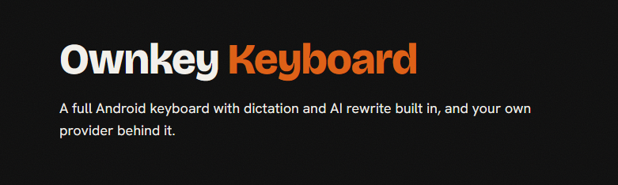
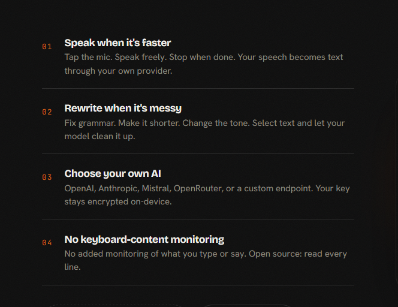
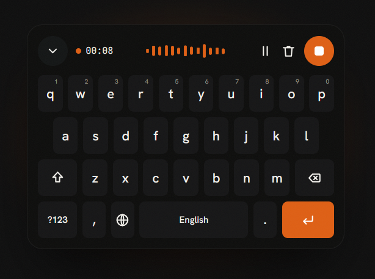

<p align="center">
  <a href="https://ownkey.bvdm.ai">
    
  </a>
</p>

<table>
  <tr>
    <td width="52%">
      
    </td>
    <td width="48%">
      
    </td>
  </tr>
</table>

<p align="center">
  <a href="https://ownkey.bvdm.ai"><strong>Website</strong></a>
  ·
  <a href="https://github.com/MajesteitBart/ownkey-keyboard"><strong>Source</strong></a>
  ·
  <a href="CONTRIBUTING.md"><strong>Contributing</strong></a>
</p>

<p align="center">
  <sub>OPEN SOURCE · NO OWNKEY ACCOUNT · BRING YOUR OWN PROVIDER</sub>
</p>

---

## 01 · The promise

### Your keys. Your voice. Your space.

Ownkey is a privacy-first, open-source Android keyboard for practical AI input. It combines everyday typing, voice dictation, and selected-text rewrite without putting an Ownkey account or hosted AI service between you and the provider you choose.

| | |
| --- | --- |
| **Bring your own key** | Use your own provider account and API key. Ownkey does not sell an AI subscription. |
| **No added content monitoring** | Ownkey does not add monitoring of what you type or say. |
| **Encrypted local keys** | Dictation and rewrite keys are kept in Android Keystore-backed encrypted preferences. |
| **Open by design** | The app is developed in the open and distributed under Apache-2.0. |

Ownkey is derived from [FlorisBoard](https://github.com/florisboard/florisboard) and keeps the full keyboard experience at its core—not just the AI features.

---

## 02 · What it does

### Speak when it is faster

Tap the microphone, speak, and insert the transcript without switching to another keyboard. Dictation defaults to Mistral Voxtral ASR and supports a configurable model and compatible transcription endpoint.

### Rewrite when the words are not quite right

Select text and rewrite it from the keyboard. Built-in provider presets cover OpenAI, Anthropic, Mistral, and OpenRouter, with a custom OpenAI-compatible endpoint option. Rewrite voices can improve writing, fix grammar, shorten text, change tone, or follow your own instruction.

### Type normally—and keep it fast

Ownkey includes suggestions, autocorrect, EN/NL frequency data, local next-word personalization, incognito controls, and split layouts for larger screens. Personalized learning stays on the device and is skipped in incognito sessions and password fields.

### Keep provider control visible

Dictation and rewrite are configured together under **Settings → AI**. Provider, endpoint, model, and key controls remain explicit, so it is clear which service handles each request.

---

## 03 · How data moves

Ownkey does not operate an AI proxy or hosted cloud service.

| Action | Ownkey behavior |
| --- | --- |
| **Normal typing** | No AI network request. Suggestions and personalized learning run on the device. |
| **Voice dictation** | Recorded audio is sent directly to the ASR endpoint configured in Ownkey; the transcript is returned to the keyboard. |
| **AI rewrite** | The selected text and rewrite instruction are sent directly to the configured LLM endpoint; the result is returned for review before insertion. |
| **API keys** | Keys are stored encrypted on the Android device using Keystore-backed storage. |

When you use a cloud provider, that provider receives the request data and its privacy policy, retention terms, and billing apply. A ChatGPT or Claude app subscription does not replace API access.

---

## 04 · Bring your own key

1. **Get an API key** from the provider you want to use.
2. **Open Settings → AI** and configure dictation, rewrite, or both.
3. **Choose the provider, endpoint, and model**, then save the corresponding key.
4. **Dictate or rewrite** from the keyboard.

Dictation defaults to:

- Endpoint: `https://api.mistral.ai/v1/audio/transcriptions`
- Model: `voxtral-mini-latest`

See [VOXTRAL_API_SETUP.md](VOXTRAL_API_SETUP.md) for direct-provider and relay setup notes.

---

## 05 · Install and build

Ownkey is currently pre-release; Google Play distribution is coming soon. Developers and testers can build it from source.

### Requirements

- Android Studio (current stable)
- JDK 17
- Android SDK 36
- Android 8.0 / API 26 or newer for the phone app

### Build the Android app

```bash
./gradlew :app:assembleDebug
```

On Windows, use:

```powershell
.\gradlew.bat :app:assembleDebug
```

Install the generated debug APK, enable **Ownkey Keyboard** in Android's keyboard settings, then open Ownkey and complete setup.

### Optional Wear OS companion

The repository also contains a Wear OS IME focused on transcript-first voice input:

```bash
./gradlew :wear:assembleDebug
```

Phone and Wear artifacts are built by the [Ownkey Android CI workflow](.github/workflows/android.yml). Release runs can also produce AABs for both modules.

---

## 06 · Repository map

| Path | Purpose |
| --- | --- |
| [`app/`](app/) | Main Android keyboard, setup, settings, dictation, rewrite, prediction, and autocorrect |
| [`wear/`](wear/) | Wear OS companion IME |
| [`lib/`](lib/) | Shared Android, Compose, Kotlin, native, and theme libraries |
| [`assets/branding/`](assets/branding/) | Ownkey source artwork and store graphics |
| [`docs/brandbook/`](docs/brandbook/) | Brand references and visual direction |
| [`fastlane/metadata/android/`](fastlane/metadata/android/) | Google Play metadata and assets |

Useful project documents:

- [Changelog](CHANGELOG.md)
- [Roadmap](ROADMAP.md)
- [Voxtral API setup](VOXTRAL_API_SETUP.md)
- [Feature scope](VOXTRAL_FEATURE_SCOPE.md)
- [Ownkey brand reference](docs/brandbook/ownkey-delano-brand-reference-2026-05-31.html)

---

## 07 · Contributing

Contributions are welcome. Start with [CONTRIBUTING.md](CONTRIBUTING.md) and the [Code of Conduct](CODE_OF_CONDUCT.md).

The project prioritizes:

1. Responsive, trustworthy everyday typing
2. Clear privacy boundaries and provider control
3. Low-friction dictation and rewrite
4. Accessible, consistent Ownkey design
5. Respectful attribution of FlorisBoard and other upstream work

---

## License and attribution

Ownkey Keyboard is distributed under the [Apache License 2.0](LICENSE).

It is derived from [FlorisBoard](https://github.com/florisboard/florisboard), with Ownkey-specific work across AI dictation and rewrite, encrypted key storage, typing quality, Wear OS support, and product design.

<p align="center">
  <strong>Your keys. Your voice. Your space.</strong>
</p>
