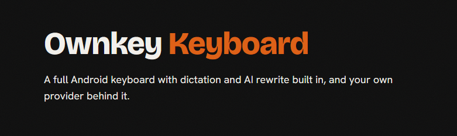
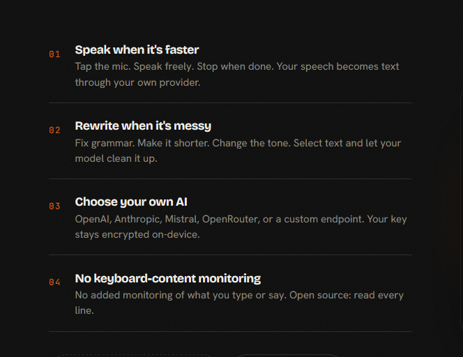
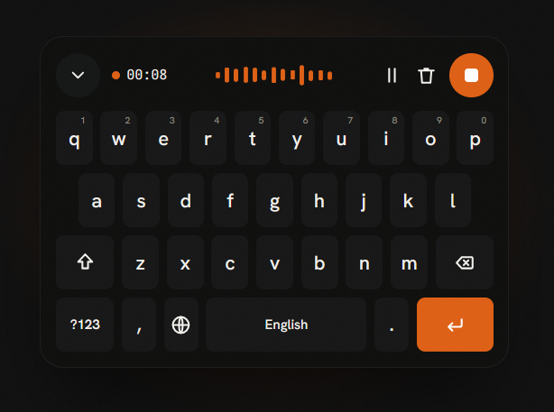

<p align="center">
  <a href="https://ownkey.bvdm.ai">
    
  </a>
</p>

<table>
  <tr>
    <td width="52%">
      
    </td>
    <td width="48%">
      
    </td>
  </tr>
</table>

<p align="center">
  <a href="https://ownkey.bvdm.ai"><strong>Website</strong></a>
  ·
  <a href="https://github.com/MajesteitBart/ownkey-keyboard/releases/latest"><strong>Download</strong></a>
  ·
  <a href="CONTRIBUTING.md"><strong>Contributing</strong></a>
</p>

# Ownkey Keyboard

Ownkey is an open-source Android keyboard with voice dictation and AI rewrite built in. You bring your own API key. Dictation audio and rewrite requests go straight from your phone to the provider you configure. There is no Ownkey account and no Ownkey server in between.

Ownkey is a fork of [FlorisBoard](https://github.com/florisboard/florisboard), so it keeps FlorisBoard's layouts, themes, clipboard and glide typing. On top of that it adds dictation, rewrite, a rebuilt English and Dutch autocorrect, a floating split keyboard for tablets and a voice-only mode.

## Install

Download the APK for your phone from the [latest release](https://github.com/MajesteitBart/ownkey-keyboard/releases/latest). Almost every current phone needs `arm64-v8a`. Older 32-bit phones need `armeabi-v7a`, and the `x86_64` and `x86` builds are for emulators. Each release lists the checksums in `SHA256SUMS`.

Ownkey needs Android 8.0 (API 26) or newer. After installing, open Ownkey and follow the setup to enable it as your keyboard. Typing works right away. In release builds, dictation and rewrite use a cloud provider, so they need an API key. [Set up AI](#set-up-ai) walks through it.

## What it does

### Typing and autocorrect

Autocorrect was rebuilt in 0.8.0 for English, Dutch and mixed Dutch and English typing. When you press space, it fixes typos based on which keys are next to each other, where your finger actually landed and the word before. It also predicts the next word, adds apostrophes (`dont` becomes "don't") and splits words that ran together.

Choose Gentle, Normal or Strong under **Autocorrect strength** in the typing settings. After a correction, the word you typed is the first suggestion, and backspace brings it back too. Words you keep typing stop getting corrected. With "Block possibly offensive words" on, which is the default, words on Ownkey's reviewed block lists stay out of suggestions, predictions and autocorrect.

Keyboards in other languages fall back to FlorisBoard's older English word list. They get the new scoring, but not the new dictionaries, word-pair data or apostrophe rules.

Ownkey learns your own word sequences to improve predictions. That data stays on the phone, and learning is skipped in incognito mode and password fields.

### Dictation

Tap the microphone, speak and tap stop. Ownkey inserts the transcript at the cursor. Dictation uses Mistral Voxtral by default, and you can point it at another compatible transcription endpoint and model.

The personal dictionary under **Settings → AI** helps with names and jargon. With Mistral and OpenAI, saved words go along as recognition hints. Saved corrections are applied to every transcript, and filler words can be removed. When dictation mishears a word, "Fix a word" on the keyboard turns it into a saved correction.

**More → Voice only** replaces the keyboard with a small bar that holds the microphone. You can drag it anywhere on screen. Password, incognito and number fields still get the full keyboard. See [docs/voice-only-keyboard.md](docs/voice-only-keyboard.md).

### Rewrite

Select text, open AI rewrite and pick a voice: Improve writing, Fix grammar, Make shorter, Rewrite in Dutch, Plainspoken or one you write yourself. You see the result first, and your text only changes when you tap Insert. To give the instruction by voice, hold the microphone key instead.

Rewrite has presets for OpenAI (Responses and Chat Completions), Anthropic, Mistral and OpenRouter, and it accepts any OpenAI-compatible endpoint. OpenRouter is the default.

### Tablets and foldables

On a wide screen the keyboard can split in two, with a space bar on each half. **More → Floating** turns the halves into two panels you can drag and resize, with rewrite, clipboard and dictation above the keys. See [docs/floating-split-tablet.md](docs/floating-split-tablet.md).

### Wear OS

[`wear/`](wear/) contains a dictation-first keyboard for Wear OS 3 and newer. The stable releases don't include it yet. The rolling [Ownkey CI debug](https://github.com/MajesteitBart/ownkey-keyboard/releases/tag/ci-debug) prerelease has a debug build, `ownkey-wear-ci-debug.apk`, or you can build it from source.

## Set up AI

1. Create an API key with the provider you want. A ChatGPT or Claude app subscription doesn't include API access.
2. Open **Settings → AI**.
3. For dictation, keep the Mistral defaults or enter another endpoint and model, then paste your key.
4. For rewrite, pick a provider, check the model, then paste its key.

| | Provider | Endpoint | Model |
| --- | --- | --- | --- |
| Dictation | Mistral | `https://api.mistral.ai/v1/audio/transcriptions` | `voxtral-mini-latest` |
| Rewrite | OpenRouter | `https://openrouter.ai/api/v1/chat/completions` | `meta/muse-spark-1.1` |

Ownkey stores API keys encrypted on the phone, using Android Keystore. [VOXTRAL_API_SETUP.md](VOXTRAL_API_SETUP.md) explains how to send dictation through your own relay instead of calling Mistral directly.

## Where your data goes

| What you do | What leaves the phone |
| --- | --- |
| Type | No AI requests. Suggestions, autocorrect and learning run on the phone. |
| Dictate | The recording goes to your dictation endpoint. By default, Mistral and OpenAI endpoints also get your personal dictionary words as hints. The personal dictionary settings can turn this off or send hints to any endpoint. |
| Rewrite | The selected text and the instruction go to your rewrite endpoint. |
| Rewrite by voice | The spoken instruction goes to your dictation endpoint. The selected text and the recognized instruction then go to your rewrite endpoint. |

Ownkey doesn't operate a relay of its own and doesn't add monitoring of what you type or say. Once a request reaches your provider, that provider's privacy policy, retention terms and billing apply.

### On-device dictation

Debug and beta builds include Orukeet, an on-device speech model that transcribes Dutch and English without an API key or internet connection. The audio stays on the phone. It's a 672 MB download. Public releases don't include it yet, because testing on physical phones isn't finished.

## Build from source

You need JDK 17, [Rust](https://www.rust-lang.org/tools/install) through `rustup`, and the Android SDK for API 36. The build also uses the NDK and CMake versions listed in [`gradle/tools.versions.toml`](gradle/tools.versions.toml). [CONTRIBUTING.md](CONTRIBUTING.md) has the full list.

```bash
./gradlew :app:assembleDebug        # phone app
./gradlew :app:testDebugUnitTest    # unit tests, including the autocorrect benchmark
./gradlew :wear:assembleDebug       # Wear OS keyboard
```

On Windows, use `.\gradlew.bat` instead of `./gradlew`.

| Build type | Package | Notes |
| --- | --- | --- |
| `debug` | `nl.bartvandermeeren.ownkey.debug` | Installs next to the release app. Includes Orukeet. |
| `beta` | `nl.bartvandermeeren.ownkey.beta` | Minified and signed with the debug key. Includes Orukeet. |
| `release` | `nl.bartvandermeeren.ownkey` | Signed with the key in `keystore.properties` if present, otherwise with the debug key. |

APKs are split per processor type. Pass `-Pownkey.apkSplits=false` to build a single APK. The [Android CI workflow](.github/workflows/android.yml) builds the phone and Wear apps for every pull request to `main`.

## Repository map

| Path | Contents |
| --- | --- |
| [`app/`](app/) | The phone keyboard: typing, autocorrect, dictation, rewrite and settings |
| [`wear/`](wear/) | Wear OS keyboard |
| [`lib/`](lib/) | Shared Android, Compose, Kotlin, native and theme libraries |
| [`tools/`](tools/) | Dictionary build scripts, autocorrect test data and the Orukeet runtime |
| [`docs/`](docs/) | Feature notes, screenshots and the brand book |
| [`.project/`](.project/) | Specs, plans and decisions per feature, such as the [autocorrect rebuild](.project/projects/autocorrect-engine/spec.md) |
| [`fastlane/metadata/android/`](fastlane/metadata/android/) | Google Play listing text and images |

## Contributing

Issues and pull requests are welcome in this repository. [CONTRIBUTING.md](CONTRIBUTING.md) covers bug reports, translations, build requirements and what a pull request needs.

Typing speed comes first. AI network work must never block normal typing, suggestions or opening the keyboard.

## License and attribution

Ownkey Keyboard is licensed under the [Apache License 2.0](LICENSE). It is derived from [FlorisBoard](https://github.com/florisboard/florisboard) by Patrick Goldinger and contributors.

The English and Dutch dictionaries are built from FrequencyWords (CC BY-SA 4.0), SCOWL, the OpenTaal word list and Tatoeba sentences (CC BY 2.0 FR). See [the dictionary attribution](app/src/main/assets/ime/dict/latin/ATTRIBUTION.md) for versions and licenses.
