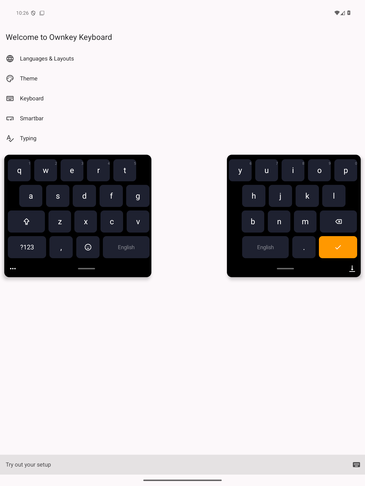

# Floating split keyboard on tablets

On a screen at least 600dp wide, set **Keyboard > Split keyboard** to **Automatic** (or
Always), then open the keyboard's **More > Floating** action. Floating mode keeps
the existing split arrangement, stagger, duplicate space bars, selected language,
theme, and configurable split gap. It does not add punctuation to the letter rows.
Drag either panel's handle to reposition the pair; tap it to show resize controls.
The left panel's More button opens keyboard actions. The right panel's dock
button returns to the docked keyboard.
AI rewrite, undo, copy, More, paste, clipboard, and dictation are directly visible
above the keys. Only drag handles and Dock remain below the keys.
The microphone retains the standard tap/hold voice actions.
Use **Keyboard > Layout > Floating split background opacity** to adjust the panel
backgrounds and shadows from 0% (transparent) to 100% (opaque), in 1% steps.
Keys and the small control surfaces remain opaque for contrast. The value is
saved and defaults to 100%; the earlier transparency toggle migrates to 0% when
enabled and 100% when disabled.

The typing view consists of two separate rounded panels, each with its own shadow.
There is no background, toolbar, or navigation strip connecting them. The panels
start near the bottom with a 12dp inset at the bottom and each outer edge.
Dragging them to the bottom keeps them floating, without a docking indicator or
automatic docking. Use the Dock button to attach the keyboard. Existing saved
positions are preserved; dragging saves the new position.
Resizing retains at least 80% of the available width. Phone floating mode
and tablets with split disabled retain the compact floating window. Window sizes
and placement are stored separately for the two floating variants. Changing the
Split keyboard setting while floating switches between the two right away.

The panels use the theme's Window style, including its shape, border, shadow, and
background image, so custom themes look the same as in the other window modes.

The empty center is transparent and passes touches to the underlying app. Its
bounds are the intersection of the gaps in every row, preserving the touch areas
of inward-staggered keys, extended through the full height of both panels.
The Smartbar is hidden during ordinary floating split typing. Explicitly opened
actions, rewrite, and active audio controls use a temporary continuous surface;
closing those controls restores the two panels. Movement controls stay on the panels.
Numeric layouts, media, clipboard, and other unsplit panels retain their complete
touch region. The app behind a floating keyboard is not resized.

Geometry scales with available width, density, keyboard size, and the existing
split-gap preference, rather than hard-coding screenshot pixels. For the supplied
color direction, select the AMOLED black theme preset and an orange accent in
Theme settings. User theme choices remain in effect in both window modes.

## Verification on 2026-09-25

- `:app:testDebugUnitTest` passed all 508 tests, including switching Split
  keyboard between Automatic, Never, and Always while floating, voice-only
  across a phone rotation, and a stored window config that still has the earlier
  per-form-factor voice-only key. `:app:assembleDebug` and `:app:assembleBeta`
  passed.
- Beta build on the API 35 emulator, 1080 × 2400 pixels at 240dpi, Signal
  Graphite: the floating split panels drew with the theme's rounded shape and
  shadow. Setting Split keyboard to Never while floating showed the compact
  floating window on the next keyboard open, without docking first. Voice-only
  stayed on after rotating to landscape and back.

## Verification — 2026-09-22

- Split gap after recreation: the keyboard read its own bounds only inside a
  side effect, so a freshly composed keyboard, for example after the
  voice-only bar, never reported the gap. The panels then drew as one surface
  and the center stopped passing touches through. The bounds are now read
  during composition; on the emulator, `dumpsys window` shows the two-part
  touch region again after returning from the bar.

- Opacity slider: debug and release APK builds and `git diff --check` passed.
  On the tablet emulator, the old enabled transparency preference migrated to
  0%; changed the slider to 50% and confirmed the saved settings value.
  [Slider screenshot](screenshots/floating-split-opacity-slider.png).

- Moved action controls above the keys: debug APK build and `git diff --check`
  passed. Confirmed the upper action rows and lower movement controls on the
  API 35 tablet emulator with transparency enabled.
  [Corrected action placement](screenshots/floating-split-actions-top.png).

- Transparency and visible-controls follow-up: `:app:testDebugUnitTest` passed
  all 486 tests; `:app:assembleDebug` and `:app:assembleRelease` passed. On an API 35 tablet emulator,
  enabled transparency through Keyboard settings, checked the controls on both
  panels, and typed with the transparent layout. Physical-device validation and
  end-to-end transcription with these controls remain pending.
  [Transparent layout preview](screenshots/floating-split-transparent.png).

- Bottom-placement follow-up: removed automatic docking and its indicator for
  floating split mode, set the default bottom inset to 12dp, and retained explicit
  docking and saved positions. `:app:testDebugUnitTest` and `:app:assembleDebug`
  passed. Regression coverage checks bottom-edge release, persisted placement,
  explicit docking/reopening, and compact floating mode's existing docking behavior.
  Physical-device verification of this follow-up remains pending.

- Based on `origin/main` at `afd9dad8`, branch `feature/floating-split-tablet`.
- `:app:testDebugUnitTest`: 484 tests passed, none skipped. Includes the shared
  gap's staggered touch safety, gap reset, dual-space restoration after compact
  layout, tablet/phone toggle policy, and window move/resize property tests.
- `:app:assembleDebug` and `:app:assembleRelease`: passed.
- `git diff --check`: passed.
- Android API 35 emulator, 1536 × 2048 pixels at 240dpi: opened the existing split
  layout, switched through More > Floating, checked both space bars and the
  transparent center, typed with both halves, moved the panels together, opened
  and closed the actions panel, docked and reopened the floating keyboard, and
  tapped through the center to open the
  underlying settings screen. The screenshot records the corrected two-panel
  design, replacing the earlier single surface with a rectangular hole.
- Gradle's filtered Kotest invocation discovered classes but ran no cases; the
  successful evidence above is from the complete, unfiltered suite.
- Physical tablet/foldable validation has not been performed. The halves move
  together through the existing window controls; independent half dragging is
  not implemented.
