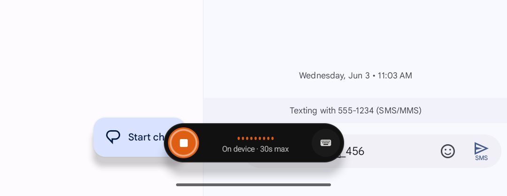
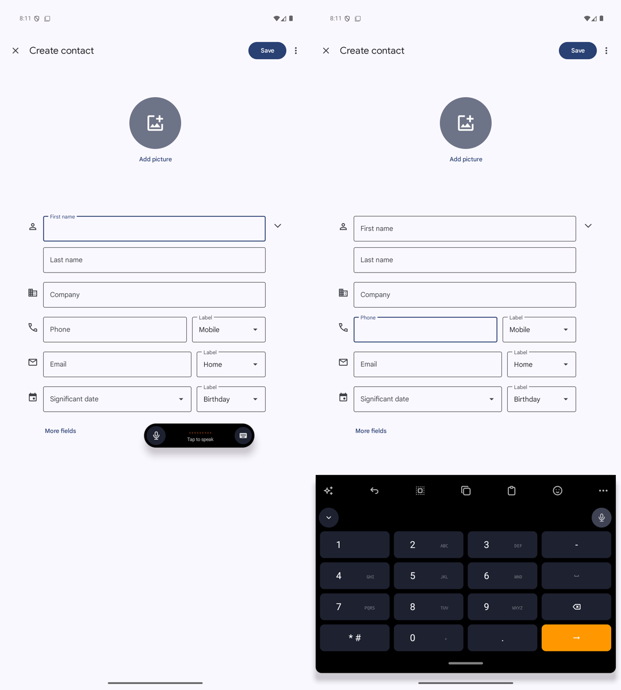

# Voice-only keyboard

Open **More > Voice only** to replace the keyboard with a single bar. The bar
holds the dictation button, the live level meter and status, and a keyboard
button that brings the full keyboard back. It uses the same dictation pipeline,
provider, and speech dictionary as the microphone key; nothing else records.

Tap the microphone to start. Tap it again to stop and insert the transcript.
While the transcript is processed, the button shows a spinner and a close icon,
and tapping it cancels. Hold-to-rewrite is not available in the bar, because the
rewrite panel needs the full keyboard. Pause and cancel during a recording are
also left to the full keyboard: tap the keyboard button, and the recording
continues in the Smartbar row with its pause, cancel, and stop controls.

The bar starts 16dp above the navigation bar, centered. Drag it anywhere on
screen to uncover app controls; it cannot move below that starting point or off
an edge. The position is saved per form factor and clamped again after a
rotation. Only the bar is touchable: every touch outside it reaches the app, and
the app is not resized.

The choice persists across fields and restarts until you tap the keyboard
button. Password fields, incognito mode, and number, phone, and date fields show
the full keyboard instead, because the bar cannot help there, and return to the
bar in the next ordinary text field. Leaving voice-only restores whichever
keyboard was active before, docked or floating.

## Verification on 2026-09-22

- `:app:testDebugUnitTest` passed all 497 tests, including the voice-only
  toggle and fallback, a window config saved before this change, and the drag
  clamp. `:app:assembleDebug` passed.
- Android API 35 emulator, 1080 × 2400 pixels at 240dpi, on-device Orukeet
  backend: opened More > Voice only from the floating split keyboard in
  Messages; started and stopped a recording and saw the processing state;
  tapped the app's Start chat button beside the bar, which opened a new
  conversation; dragged the bar up and confirmed with `dumpsys window` that the
  touchable region moved with it; returned to the split keyboard with the
  keyboard button; in Contacts, saw the bar in the name field and the phone
  keypad in the phone field.
- The emulator ran without audio input, so the level meter stayed flat and no
  transcript was inserted. A physical device check of live levels and insertion
  is still pending.
- Found and fixed a floating split bug while testing: after the keyboard was
  recreated, as when leaving the bar, the split gap was never reported, so the
  panels drew as one surface and the center stopped passing touches through.
