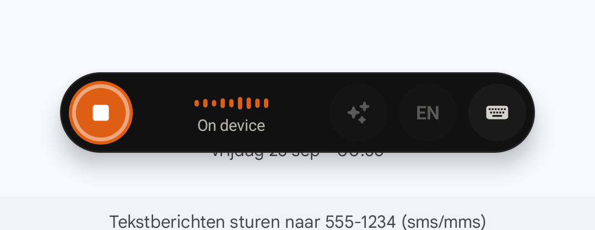
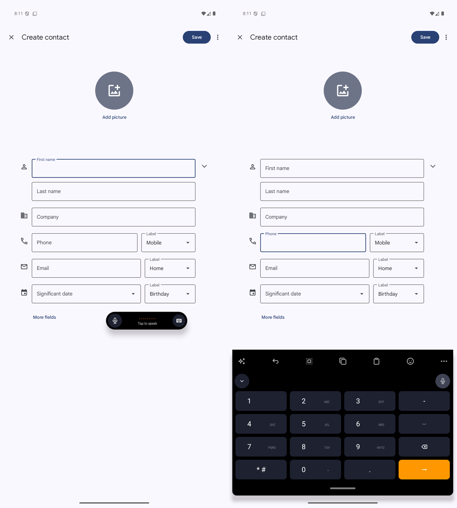
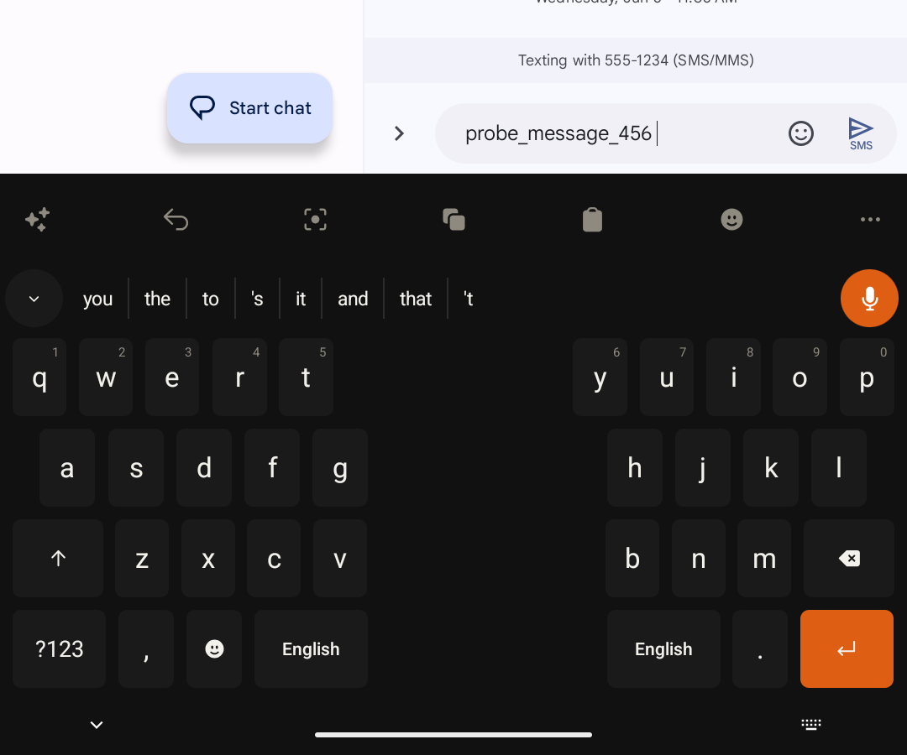

# Voice-only keyboard

Open **More > Voice only** to replace the keyboard with a single bar. The bar
holds the dictation button, the live level meter and status, a rewrite button,
a language button, and a keyboard button that brings the full keyboard back.
It uses the same dictation pipeline, provider, and speech dictionary as the
microphone key; nothing else records.

Tap the orange microphone to start. While it listens, the button shows a stop
square inside a white ring; tap it to stop and insert the transcript. While the
transcript is processed, the button shows only a spinning orange arc, and a tap
just reports that it is still working. Pause and cancel are left to the full
keyboard: tap the keyboard button, and the recording continues in the Smartbar
row with its pause, cancel, and stop controls.

The sparkles button opens the rewrite panel, including "Tell Ownkey what to
change" for a spoken instruction. The panel needs the room of the full
keyboard, so the keyboard shows while the panel is open and the bar comes back
when you close it or insert the result. Voice-only stays on throughout; the
Voice only action in the full keyboard returns to the bar instead of turning it
off.

With more than one keyboard language, the language button shows the active one
as a code such as EN or NL, and a tap switches to the next. Cloud dictation set
to follow the keyboard language uses it for the next recording; Orukeet detects
the language itself. With one language the button is left out. Both buttons are
dimmed while a recording runs. On a narrow screen the status column gets
narrower so every button still fits.

When dictation fails, the button shows an exclamation mark and the status line
names the reason, for example "No API key" or "No microphone access". A cloud
provider without an API key now fails before recording starts, instead of after
the user has spoken. Messages that would cover the bar appear just above it and
close on their own. The button states are shared with the keyboard's mic key;
see "Dictation button states" in `docs/brandbook/ownkey-brand-token-map-2026-05-31.md`.

The bar starts 16dp above the navigation bar, centered. Drag it anywhere on
screen to uncover app controls; it cannot move below that starting point or off
an edge. The position is saved per form factor and clamped again after a
rotation. Only the bar is touchable: every touch outside it reaches the app, and
the app is not resized.

The choice persists across fields, rotations, and restarts until you tap the
keyboard button. Password fields, incognito mode, and number, phone, and date
fields show the full keyboard instead, because the bar cannot help there, and
return to the bar in the next ordinary text field. Leaving voice-only restores whichever
keyboard was active before, docked or floating.

## Verification on 2026-09-22

- `:app:testDebugUnitTest` passed all 497 tests, including the voice-only
  toggle and fallback, a window config saved before this change, and the drag
  clamp. `:app:assembleDebug` passed.
- Android API 35 emulator, 1080 × 2400 pixels at 240dpi, on-device Orukeet
  backend: opened More > Voice only from the floating split keyboard in
  Messages; started and stopped a recording and saw the processing state;
  tapped the app's Start chat button beside the bar, which opened a new
  conversation; dragged the bar up and confirmed with `dumpsys window` that the
  touchable region moved with it; returned to the split keyboard with the
  keyboard button; in Contacts, saw the bar in the name field and the phone
  keypad in the phone field.
- The emulator ran without audio input, so the level meter stayed flat and no
  transcript was inserted. A physical device check of live levels and insertion
  is still pending.
- Found and fixed a floating split bug while testing: after the keyboard was
  recreated, as when leaving the bar, the split gap was never reported, so the
  panels drew as one surface and the center stopped passing touches through.

## Verification on 2026-09-23: mic states and Signal theme

- `:app:testDebugUnitTest` passed all 500 tests, including the button state
  mapping and the missing-key check. `:app:assembleDebug` and
  `:app:assembleRelease` passed.
- Same emulator, Signal Graphite preset: saw idle, listening, and transcribing
  in the bar and in the Smartbar row; revoked the microphone permission and saw
  "No microphone access"; set the stored provider to cloud without a key and saw
  "No API key" before any recording; restored the permission and the provider.
- Not checked on a device: the orange AI icon for a ready rewrite result, which
  needs a configured rewrite provider.

## Verification on 2026-10-04: rewrite and language buttons

- `:app:testDebugUnitTest` passed, including the tests that the rewrite panel
  holds the bar back and returns it, and that the status column narrows on small
  screens. `:app:assembleDebug` passed.
- Same emulator with the phone set to Dutch, Orukeet for dictation and Mistral
  for rewrite: the bar showed NL; the language button switched between NL and
  EN; the rewrite button opened the rewrite panel in the full keyboard; Fix
  grammar returned a corrected sentence; Insert replaced the text and the bar
  came back. During a recording both new buttons were dimmed. The keyboard
  showed "English" on the space bar instead of the Dutch "Engels".
